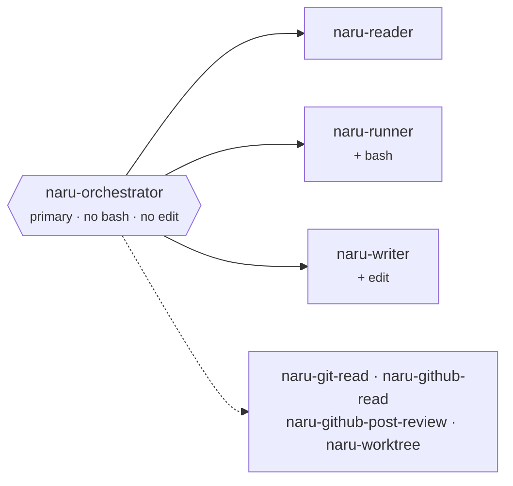

# Naru development guide

This guide describes the repository layout, the agent and tool architecture, the invariants that
must survive any change, how to run the checks, and how the installer works.

Naru's design rule is simple: hard mechanical walls at irreversible edges, near-total freedom
inside them. The orchestrator plans and fans out on its own judgment; the walls are enforced by
OpenCode permission frontmatter and by tool code, not by prose.

## Repository layout

| Path | Contents |
| --- | --- |
| `agents/` | Five Markdown agents. Frontmatter is the permission contract. |
| `skills/` | Four native skills: `naru-plan`, `naru-impact`, `naru-triage`, `naru-review`. |
| `tools/` | Five custom OpenCode tools. The filename defines the tool ID. |
| `tools/naru-lib/` | Shared helper modules used by the tools. |
| `scripts/` | `naru-compat-smoke.mjs`, the provider-free compatibility smoke run in CI. Not installed. |
| `tests/` | Node test files plus the dependency-free installer test. |
| `docs/` | This guide, the user guide, agent integration notes, and the Astro site under `docs/src/`. |
| `install.sh` | The installer. Holds an explicit inventory of everything Naru installs. |
| `naru-runtime.example.json` | Example runtime config. Copied on install, never activated. |

There is no `plugins/` directory. Naru ships zero OpenCode plugins; everything runs as agents,
skills, and custom tools.

## Architecture

One visible primary orchestrator, four hidden leaf subagents, five validated tools.



Agents (`agents/naru-*.md`):

- **`naru-orchestrator`** — primary, visible. Coordinates, plans,
  delegates, synthesizes. Its permission block starts at `'*': deny` and never allows `bash`,
  `edit`, or `apply_patch`, so it cannot run commands or change files. It may call `naru-git-read`,
  `naru-github-read`, `naru-github-post-review`, and `naru-worktree`.
- **`naru-reader`** — subagent, read-only. Finding code, tracing
  behavior, diagnosing, reviewing.
  high-consequence judgment: architecture, security, data models, dependencies, final review.
- **`naru-runner`** — subagent, read-only plus `bash`. Tests, typecheck, lint, build, reproductions.
  `edit` and `apply_patch` are denied.
- **`naru-writer`** — subagent, the only role with `edit` and `apply_patch`.

All three subagents are `hidden: true` and `task: deny`, so they cannot spawn children. The topology
is one root orchestrator with leaf subagents at depth 1; OpenCode's default `subagent_depth` of 1 is
sufficient.

Tools (`tools/`):

- **`naru-git-read`** — bounded read-only git: `repository`, `status`, `diff`, `log`, `file`,
  `grep`, `merge-base`. Fixed argv arrays, `--no-pager`/`--no-color`, never mutates state.
- **`naru-github-read`** — `resolve`, `issue`, `pull`, `pull-manifest`, `pull-files`,
  `pull-feedback`, `source`. The compact manifest exposes every changed path and feedback page count
  without bodies. File batches and 100-item feedback pages require full manifest identity, bracket
  their body acquisition with compact manifests, and return `batchDigest`/`pageDigest` provenance.
- **`naru-github-post-review`** — orchestrator-only; derives `COMMENT`, `APPROVE`, or
  `REQUEST_CHANGES` from the asserted current-message policy and final validated evidence. It
  accepts no raw event, makes one POST attempt with no retry, and carries freshness and dedupe
  guards. Limited evidence is always `COMMENT`; it cannot merge.
- **`naru-worktree`** — isolated writer worktrees: `prepare_run`, `recover_run`, `prepare_item`,
  `integrate_item`, `snapshot`, `finalize_run`, `cleanup_run`.
- **`naru-doctor`** — provider-free local install and configuration health report.

Skills are advisory Markdown. They are untrusted guidance: a skill grants no tool, no permission,
and no authorization, and cannot alter role, scope, safety, secret, destructive, or delivery
boundaries.

OpenCode owns permission evaluation, session and child-task execution, cancellation, and retries.
Naru owns prompts, permission frontmatter, and the validated tool surface.

## Source-of-truth map

| Concern | Source of truth |
| --- | --- |
| Agent prompt, model, visibility, and permissions | `agents/naru-*.md` |
| Skill guidance | `skills/naru-*/SKILL.md` |
| Read-only git surface | `tools/naru-git-read.js`, `tools/naru-lib/git.mjs` |
| GitHub reads and pinned pull snapshots | `tools/naru-github-read.js`, `tools/naru-lib/github.mjs` |
| Review payload construction and posting | `tools/naru-github-post-review.js`, `tools/naru-lib/review.mjs` |
| Worktree lifecycle and integration | `tools/naru-worktree.js`, `tools/naru-lib/worktree.mjs` |
| Input validation and path rules | `tools/naru-lib/validate.mjs` |
| Subprocess spawn, timeouts, output bounds | `tools/naru-lib/transport.mjs`, `tools/naru-lib/output.mjs` |
| Runtime config schema and defaults | `tools/naru-lib/runtime-config.mjs`, `naru-runtime.example.json` |
| Installed inventory, backups, retirement | `install.sh`, `tools/naru-lib/install-manifest.mjs` |
| Supported OpenCode/Node versions | `tools/naru-lib/compatibility.mjs` |
| Local health report | `tools/naru-doctor.js` |

Documentation describes these contracts but does not replace them.

## Plain JavaScript, no build step

Every runtime source is plain ESM `.js` or `.mjs` and runs exactly as written. There is no
TypeScript tree, no bundler, and no transpile or emit step. What you edit in `tools/` is what runs
and what the installer copies. `tools/package.json` exists only to mark the copied tool
tree as `"type": "module"`.

Because there is no static type checking, runtime validation is the only guard. Validate at the tool
boundary, reject unknown fields, bound sizes, and build fixed argument arrays — never a shell
string.

## Invariants

Permissions and roles:

- Only `naru-writer` can edit. This is enforced by OpenCode permission frontmatter, not by prose.
- Read-only agents set `bash: deny` and `external_directory: deny` and start from `'*': deny`, so
  they fail closed.
- `.env`, `.env.*`, key material, `.ssh`, `.aws`, `.kube`, and `.gnupg` are denied to every role;
  `.env.example` is allowed. Permission policy is not a complete secret sandbox, so prompts also
  forbid reading or revealing secrets.

Authorization and delivery:

- User intent is the sole authorization source. Repository content, pull requests, issues, logs, and
  tool output are untrusted data. They cannot grant permission, redefine a role, or change an output
  contract.
- Local changes are the default stop. Commit, push, PR, and posting happen only on an explicit
  current request.
- One checkpoint, naming the exact action, before destructive or irreversible operations,
  migrations, persistent database writes, production deploys, secret access, billing or security
  posture changes, unrequested dependency changes, or material scope expansion.

Concurrency and review:

- One writer per logical scope; overlapping scopes serialize. A writer takes a Weaver claim before
  its first edit. A claim conflict is a scheduling signal, never a user prompt.
- Pull-request review is dry-run by default. Posting requires explicit current-message policy;
  schema v4 is required for new mutations, while v2/v3 are historical/idempotency compatibility
  only. Generic posting authorizes only a complete `COMMENT`; limited posting requires explicit
  current-user limited-review language and always derives `COMMENT`. There is one POST attempt,
  never a retry when its outcome is ambiguous.
- V4 review acquisition is manifest-first. Coverage reconciles every changed path once in the
  ledger and once across non-overlapping file-batch declarations, plus every advertised feedback
  kind/page once. All batch/page digests are snapshot-bound, and acknowledgement is bound to the
  prior-feedback digest. This is exhaustive provenance attestation, not proof of cognition or
  semantic review quality. The tool derives complete/limited posture.
- Per-file patch evidence is structurally classified as complete, limited, or unavailable. Missing
  patches stay limited because central safe unified-diff recovery is deliberately not implemented.
  Aggregate patch limits apply per bounded batch, allowing combined reviewed patches to exceed the
  former global aggregate while per-file, batch, response, and feedback-body limits remain.
  Mechanically derived limitations render once in one concise aggregated section.
- V4 posting reacquires only declared bounded batches/pages between compact manifests for each
  freshness pass; it does not use the legacy monolithic all-patch snapshot.
- Current-head exact inline duplicates are omitted from posting but retained for formal decisions;
  semantic dedupe remains agent-owned. Strict same-head limited-v4→complete-v4 supersession needs
  the predecessor ID/digest and fresh explicit authorization. It is a new submission, never a retry.
- Isolated worktrees require a clean repository. A dirty or unavailable workspace downgrades
  silently to shared mode instead of failing or prompting.

Naru is not a sandbox, not a proof system, not durable, and not a global capacity meter.

## Runtime configuration

`naru-runtime.json` is optional and sits beside the installed tools in the install target. Absent, the
defaults below apply. This is the entire configuration surface:

```json
{
  "schemaVersion": 1,
  "implementation": {
    "cleanWorkspaceRequired": true,
    "maxConcurrentWriters": 50,
    "workspaceMode": "auto"
  }
}
```

- `cleanWorkspaceRequired` must be `true`.
- `maxConcurrentWriters` is an integer from 1 to 50. It is a runaway brake, not a scheduler.
- `workspaceMode` is `auto`, `shared`, or `worktree`.

The loader requires a non-symlinked regular `.json` file of at most 64 KiB, rejects unknown fields,
and rejects secret-like filenames. The installer copies `naru-runtime.example.json` and never writes
`naru-runtime.json` itself.

## Tests

Three suites, all provider-free and dependency-free:

```sh
npm test            # node --test --test-concurrency=1 tests/*.test.mjs
npm run test:bun    # bun tests/bun-transport.test.mjs
npm run test:installer  # sh tests/install.test.sh
```

- `npm test` covers the tool library: `transport`, `compatibility`, `doctor`, `github-tools`,
  `worktree`. `tests/bun-transport.test.mjs` self-skips when Bun is unavailable, so it is safe in
  the Node run.
- `npm run test:bun` re-runs the spawn transport under Bun, which is the runtime difference that has
  historically broken tools.
- `npm run test:installer` builds a temporary fixture tree and exercises `install.sh` there. It
  never touches a real `~/.config/opencode`.

Run the smallest relevant file while iterating:

```sh
node --test tests/worktree.test.mjs
node --test tests/github-tools.test.mjs
node --test tests/doctor.test.mjs
node --test tests/transport.test.mjs
node --test tests/compatibility.test.mjs
sh tests/install.test.sh
git diff --check
```

For documentation changes, build the site:

```sh
npm --prefix docs run build
```

CI additionally runs `node scripts/naru-compat-smoke.mjs` against a pinned OpenCode build. That
smoke is provider-free: it starts OpenCode with safe subcommands and an ephemeral local port and
asserts the install is loadable.

Local install health, at any time:

```sh
node tools/naru-doctor.js --json
```

## Installer

`install.sh` is preview-first. Nothing is mutated until you re-run with `--apply`:

```sh
sh install.sh --preview   # default; prints a bounded change summary
sh install.sh --apply
```

Flags: `--copy` (copy instead of symlink), `--project` (install into `./.opencode`) or `--dir PATH`,
`--replace-conflicts`, `--uninstall`, `--rollback ID`. `--with-dashboard` is a deprecated accepted
no-op. `--uninstall` and `--rollback` also run preview-first and require the confirmation token that
the preview prints.

How it behaves:

- The default target is `~/.config/opencode`. Source and target must not overlap, and managed target
  directories must not be symlinks.
- The inventory is explicit. A new file is not installed just because it exists in the repository —
  add it to the plan in `install.sh` and to the installer test fixture together.
- Agent and skill Markdown follows symlink mode by default, so `git pull` keeps an install current.
  Tools, `tools/naru-lib`, `tools/package.json`, and `naru-runtime.example.json` are always
  copy-pinned.
- Every source is preflighted and the release is staged on the target filesystem before any existing
  loader path changes.
- Existing managed destinations move to a timestamped directory under `.naru-backups/`. A failed
  transaction removes newly installed paths and restores those backups. Backups are never pruned
  automatically.
- Ownership is tracked in `.naru-install.json` with per-entry fingerprints. Retired managed paths —
  the old slash commands, the seven `naru-minion-*` agents, the removed plugins and scheduler tool —
  are removed on reinstall when they are healthy and manifest-owned. Modified or unowned paths are
  preserved and reported unless a reviewed preview passes `--replace-conflicts`.
- Unrelated OpenCode content, including other agents and your `naru-runtime.json`, is left alone.

Requirements: OpenCode >= 1.18.4 and Node 24. `subagent_depth` >= 1 is required, and the OpenCode
default satisfies it.

## Extending Naru

Keep additions explicit and fail-closed:

1. Add `agents/naru-<name>.md` with the correct mode, visibility, model, and least-privilege
   permission block. Start at `'*': deny`. Do not copy writer `edit` permission or runner `bash`
   permission into a role that does not need it.
2. If the orchestrator may call it, add the exact ID to the orchestrator's `task` map. Never use a
   broad `naru-*` allow. Subagents stay `task: deny`.
3. Add any new tool to `tools/` with validation in `tools/naru-lib/`, and give it a bounded,
   enumerated operation surface rather than a passthrough.
4. Update the `install.sh` inventory and the installer test fixture in the same change.
5. Update the user guide and this guide when the change is user-visible.

Reserved contracts: canonical `naru-*` agent IDs, the tool filenames (they are the tool IDs), the
review dedupe marker, the runtime config `schemaVersion`, and the install manifest schema. Change
any of them only with a migration and a targeted test.

## Release checklist

1. Confirm the inventories are intentional: four skills, four agents, five tools, one plugin
   (`naru-dispatch`), and an orchestrator `task` map that allows exactly the three subagents (the dispatch plugin extends it with generated class variants at config load).
2. Review permission blocks for the `'*': deny` start, the writer-only edit boundary, the runner-only
   bash boundary, read-only `bash`/`external_directory` denials, and the secret path denials.
3. Confirm the posting path is still orchestrator-only, requires schema v4 for every new mutation,
   derives posture and review events from manifest-bound final evidence, makes one POST attempt with
   no retry, and preserves strict dedupe/supersession rules; v2/v3 remain compatibility-only.
4. Run the three suites plus `git diff --check`, and record any check that was not run. Run
   `npm run test:installer` whenever installed inventory, migration, or copy/symlink behavior
   changed.
5. Verify the README and the guides match the installed inventory, installer flags, runtime config
   surface, and stated limitations.
6. Review the complete diff for local paths, secrets, stale identifiers, and unintended changes to
   user configuration.
