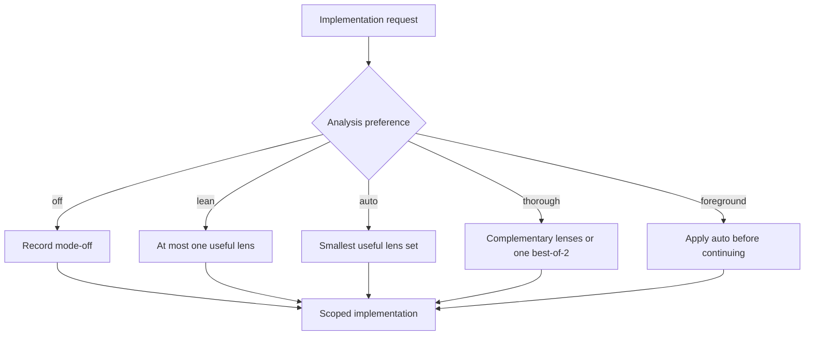

For a material implementation request, `naru-orchestrator` defaults to `auto`: it fills available read-only capacity with distinct useful lenses and queues additional useful questions for rolling refill. It does not launch irrelevant or duplicate specialists. The choice changes discretionary analysis only; it never changes authorization, edit ownership, verification, judgment, routing, or delivery boundaries.

**Walkthrough:** use Scout when ownership is unknown, Investigate when behavior is uncertain, Architect for consequential structural decisions, and a read-only Verify preparation task when a check plan needs independent review. `lean` permits at most one lens; `thorough` may add complementary evidence or one justified best-of-2 pair. `off` disables only optional analysis.

Naru proactively fills a combined ten-child automatic pool with distinct useful read-only and writer work but does not invent irrelevant fan-out. A current explicit user request may raise combined concurrency to fifty. Same-workspace writers remain capped at ten and require disjoint scheduler claims plus exact Weaver ownership before editing. Read the canonical [user guide](https://sean35mm.github.io/naru-opencode/user-guide/) for the complete selection rules.

Those limits are concurrent ceilings, not lifetime child-count ceilings. If the user explicitly requests a concrete number of independent or competing analyses, the orchestrator may intentionally repeat a lens and launches the requested number of fresh direct children in rolling waves before synthesizing all terminal reports. `subagent_depth` limits nesting, so depth `1` supports this breadth while preventing those children from spawning grandchildren.
