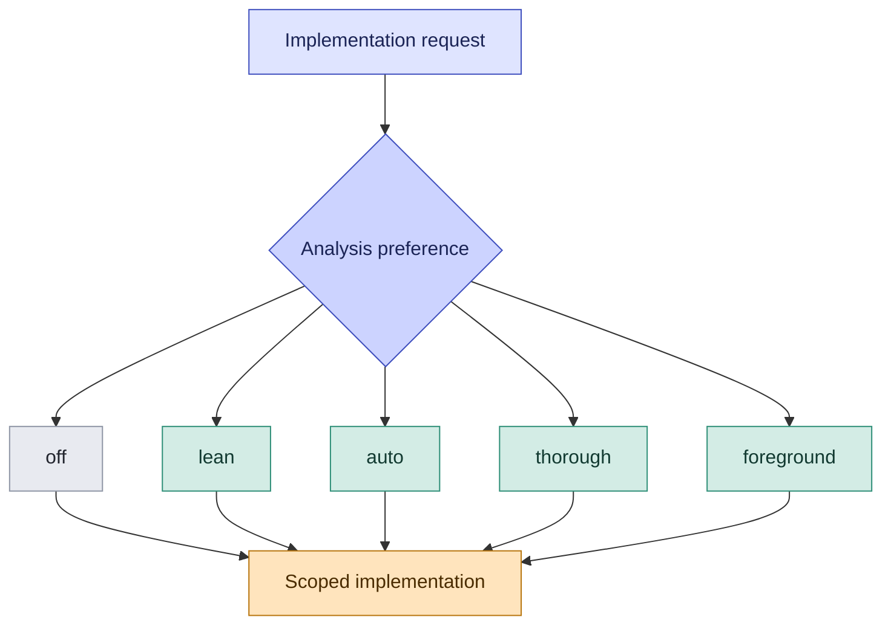
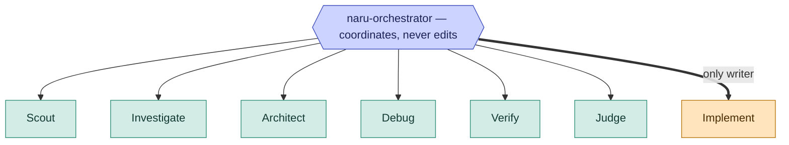

For a material implementation request, `naru-orchestrator` defaults to `auto`: it fills available read-only capacity with distinct useful lenses and queues additional useful questions for rolling refill. It does not launch irrelevant or duplicate specialists. The choice changes discretionary analysis only; it never changes authorization, edit ownership, verification, judgment, routing, or delivery boundaries.

<ul class="naru-legend">
  <li data-kind="read">Read-only</li>
  <li data-kind="write">Writes files</li>
</ul>

| Preference | Optional read-only analysis |
| --- | --- |
| `off` | None. Records mode-off and proceeds. |
| `lean` | At most one useful lens. |
| `auto` | The smallest useful lens set. This is the default. |
| `thorough` | Complementary lenses, or one justified best-of-2 pair. |
| `foreground` | Applies `auto` and finishes it before continuing. |

Every branch converges on the same scoped implementation step, because the preference changes only how much read-only evidence is gathered first. None of these branches can widen what the implementation step is allowed to touch.

**Walkthrough:** use Scout when ownership is unknown, Investigate when behavior is uncertain, Architect for consequential structural decisions, and a read-only Verify preparation task when a check plan needs independent review. `lean` permits at most one lens; `thorough` may add complementary evidence or one justified best-of-2 pair. `off` disables only optional analysis.

## The seven minions

The orchestrator coordinates but never edits. Of its seven minions, six are strictly read-only and exactly one — Implement — may modify your workspace. This is the boundary the whole workflow is built around.

<ul class="naru-legend">
  <li data-kind="read">Read-only</li>
  <li data-kind="write">Writes files</li>
</ul>

| Minion | Role | Can it change your workspace? |
| --- | --- | --- |
| Scout | Rapid read-only context | No |
| Investigate | Uncertain behaviour | No |
| Architect | Consequential structural decisions | No |
| Debug | Diagnosis, may run targeted checks | No |
| Verify | Bounded checks, may run targeted checks | No |
| Judge | Final judgment on the candidate | No |
| **Implement** | Scoped edits inside an approved packet | **Yes — only this one** |

Naru proactively fills a combined ten-child automatic pool with distinct useful read-only and writer work but does not invent irrelevant fan-out. A current explicit user request may raise combined concurrency to fifty. Same-workspace writers remain capped at ten and require disjoint scheduler claims plus exact Weaver ownership before editing. Read the canonical [user guide](/naru-opencode/user-guide/) for the complete selection rules.

Those limits are concurrent ceilings, not lifetime child-count ceilings. If the user explicitly requests a concrete number of independent or competing analyses, the orchestrator may intentionally repeat a lens and launches the requested number of fresh direct children in rolling waves before synthesizing all terminal reports. `subagent_depth` limits nesting, so depth `1` supports this breadth while preventing those children from spawning grandchildren.
