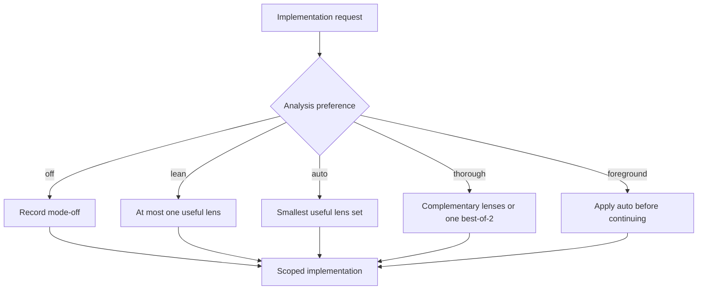

For a material implementation request, `naru-orchestrator` defaults to `auto`: it selects the smallest useful read-only lens, not every available specialist. The choice changes discretionary analysis only; it never changes authorization, edit ownership, verification, judgment, routing, or delivery boundaries.

**Walkthrough:** use Scout when ownership is unknown, Investigate when behavior is uncertain, Architect for consequential structural decisions, and a read-only Verify preparation task when a check plan needs independent review. `lean` permits at most one lens; `thorough` may add complementary evidence or one justified best-of-2 pair. `off` disables only optional analysis.

Naru does not force fan-out. It preserves limits of two active writers, two read-only children, and four total children. Read the canonical [user guide](https://sean35mm.github.io/naru-opencode/user-guide/) for the complete selection rules.
