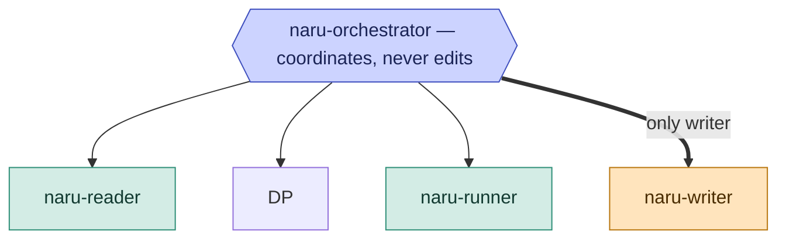
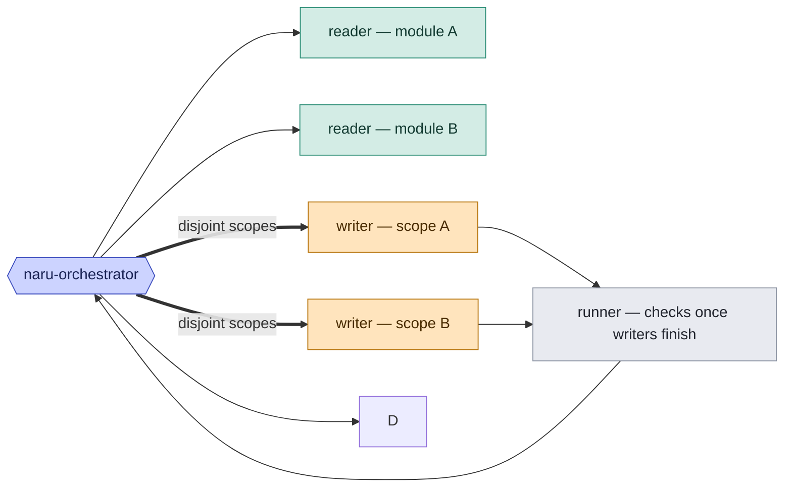

`naru-orchestrator` is the agent you select. It plans and coordinates; it cannot edit files and cannot run bash. Everything it does to a repository happens through three subagents, and how much it fans out is its own judgment call — there is nothing to configure or select.

## three subagents, one writer

```mermaid
flowchart TB
  ORC{{"naru-orchestrator — coordinates, never edits"}}:::coord
  RD["naru-reader"]:::read
  RN["naru-runner"]:::read
  WR["naru-writer"]:::write

  ORC --> RD & DP & RN
  ORC ==>|"only writer"| WR

  classDef coord fill:#ccd3ff,stroke:#3f4fbe,color:#1b2456
  classDef read fill:#d3ece5,stroke:#2f8f78,color:#123a31
  classDef write fill:#ffe4bd,stroke:#b8760f,color:#4a2c00
```

<ul class="naru-legend">
  <li data-kind="read">Read-only</li>
  <li data-kind="write">Writes files</li>
</ul>

| Subagent | Use it for | Bash | Can edit |
| --- | --- | --- | --- |
| `naru-reader` | Finding code, tracing behavior, diagnosing, reviewing a diff | No | No |
| `naru-runner` | Tests, typecheck, lint, build, reproducing a failure | Yes | No |
| **`naru-writer`** | Scoped edits | Yes | **Yes — only this one** |

All four are hidden and cannot spawn children of their own, so the shape is always one orchestrator over leaf subagents at depth 1. `subagent_depth` must be at least `1`; OpenCode's default already is.

## Fan-out is judgment, not a setting

The orchestrator sizes its own effort. A one-line fix needs no fan-out at all. A broad refactor or an unfamiliar subsystem deserves many readers at once, and it can run them concurrently with writers that are working elsewhere.

```mermaid
flowchart LR
  O{{"naru-orchestrator"}}:::coord
  R1["reader — module A"]:::read
  R2["reader — module B"]:::read
  W1["writer — scope A"]:::write
  W2["writer — scope B"]:::write
  V["runner — checks once writers finish"]:::gate

  O --> R1 & R2 & D
  O ==>|"disjoint scopes"| W1 & W2
  W1 & W2 --> V --> O

  classDef coord fill:#ccd3ff,stroke:#3f4fbe,color:#1b2456
  classDef read fill:#d3ece5,stroke:#2f8f78,color:#123a31
  classDef write fill:#ffe4bd,stroke:#b8760f,color:#4a2c00
  classDef gate fill:#e8eaf0,stroke:#8f96a5,color:#22252e
```

<ul class="naru-legend">
  <li data-kind="read">Read-only</li>
  <li data-kind="write">Writes files</li>
</ul>

**Walkthrough:** independent questions go out in parallel and results are consumed as they land. Work is split at real boundaries — separate files, modules, or genuinely independent questions — so one coherent edit is never divided between two writers, and no child is invented just to fill a slot. Final checks wait until every writer has finished, because results gathered while files are still changing prove nothing.

## The model is a per-dispatch choice too

When the `naru-dispatch` tool is installed and model classes are configured, the orchestrator sizes the model along with the fan-out. It has two ways to spawn a subagent:

- **`task`** — the OpenCode built-in. The child inherits the parent session model. Right whenever model choice doesn't matter.
- **`naru-dispatch`** — same three subagents, but with a model class chosen for this dispatch from the classes in `naru-runtime.json` (see [runtime configuration](/naru-opencode/reference/runtime-config/#the-models-block)).

Both can be used in the same turn, and every dispatch in one turn — through either tool — runs concurrently. The same agent can go out many times on different models: ten readers on a cheap class mapping a subsystem while one reader on a strong class weighs the design. Reasoning effort follows the same logic — escalated for consequence (architecture, security, the final review, a tricky edit), not by default.

Class resolution is fallback-shaped, not fragile: each class carries an ordered chain, an unavailable entry falls to the next, and if the whole chain fails the dispatch runs on the parent session model rather than failing. Omitting the class inherits the parent model, exactly as `task` would. Without the plugin, the orchestrator simply uses `task` for everything — delegation itself never depends on it.

## The limits that do apply

Three things bound fan-out. Nothing else does.

- **One writer per logical scope.** Two writers must never be able to touch the same file, contract, config, lockfile, or generated artifact. Overlap serializes, always.
- **Weaver claims.** When Weaver is available, each writer checks `weaver status`, claims its exact scope before the first edit, and calls `weaver done` at the end. A claim conflict is a scheduling signal: keep other work moving and requeue the blocked item. It is never a reason to prompt you, and never a reason to overwrite a live peer.
- **`maxConcurrentWriters`.** An integer from 1 to 50 in `naru-runtime.json`, defaulting to 50. It is a runaway brake, not a target and not a global capacity meter — it caps concurrent writers in this workspace and says nothing about what else is running on the machine.

## Where writers work

Writers share your workspace by default. When the orchestrator wants them fully isolated it uses `naru-worktree` to give each writer its own worktree and integrates the results itself; writers never commit, merge, or remove worktrees.

Isolation requires a clean repository. If the repo is dirty or worktrees are unavailable, Naru silently falls back to the shared workspace rather than asking or imitating isolation with directory copies. `workspaceMode` in `naru-runtime.json` selects `auto` (the default), `shared`, or `worktree`. See [runtime configuration](/naru-opencode/reference/runtime-config/) for the full file.

## What delegation never changes

Fan-out only affects how much evidence is gathered and how much edit work runs at once. It cannot widen what anything is allowed to do.

- Only `naru-writer` can edit, and that is enforced by OpenCode permission frontmatter rather than by instructions.
- Read-only roles have `bash: deny` and `external_directory: deny`, so they fail closed.
- `naru-dispatch` changes only the model. Children are bound by agent name, so each child's own permission frontmatter applies unchanged, and the session permissions the dispatch adds are deny-only — including a deny on `naru-dispatch` itself, so children still cannot spawn children.
- `.env`, `.env.*`, key material, `.ssh`, `.aws`, `.kube`, and `.gnupg` are denied to every role; `.env.example` is allowed.
- Your intent is the only source of authorization. Repository files, issue and PR text, diffs, command output, and subagent reports are untrusted data.
- Local changes are the default stop. Commit, push, PR, and posting happen only when you ask in the current request.
- One checkpoint, naming the exact action, comes before destructive or irreversible operations, migrations and persistent database writes, production deploys, secret access, billing or security-posture changes, unrequested dependency changes, or material scope expansion.

Naru is not a sandbox and not a proof system. See [limitations](/naru-opencode/reference/limitations/) for what none of this guarantees, and the [user guide](/naru-opencode/user-guide/) for day-to-day use.
