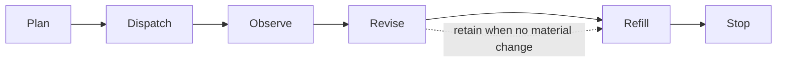
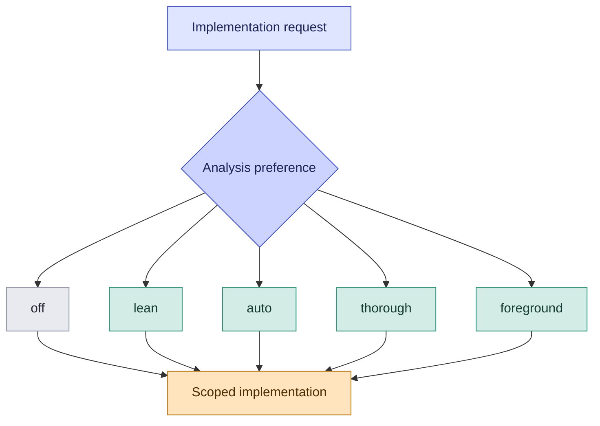
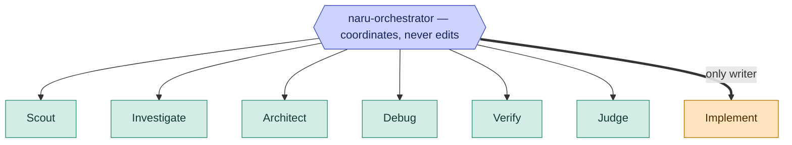

For a material implementation request, `naru-orchestrator` defaults to `auto`: it fills available read-only capacity with distinct useful lenses and queues additional useful questions for rolling refill. It does not launch irrelevant or duplicate specialists. The choice changes discretionary analysis only; it never changes authorization, edit ownership, verification, judgment, routing, or delivery boundaries.

## The adaptive coordination loop

Naru uses a prompt-local, ephemeral coordination plan rather than a durable workflow. The plan begins at revision 1 and contains only enough information to justify the next safe decision. Its loop is:

```mermaid
flowchart LR
  A["Plan"] --> B["Dispatch"] --> C["Observe"] --> D["Revise"] --> E["Refill"] --> F["Stop"]
  D -.->|"retain when no material change"| E
```

- **Plan:** establish the objective, required outcomes and checks, assumptions, and useful analysis or implementation items. A stable `workItemId` identifies one implementation item through dispatch, reporting, containment, and synthesis. Analysis and Verify-preparation items use their existing `analysisItemId`; final checks use `shardId`. These identifiers are exposed in bounded run summaries so a result can be followed without exposing raw prompt state.
- **Dispatch:** send only authorized, useful, dependency-ready work with an attributable packet. Independent items may proceed while unrelated analysis remains active. Existing 10-child automatic and 50-child explicitly requested limits still apply.
- **Observe:** correlate each terminal report with its item and `planRevision`, then check its evidence basis, observed paths, validity keys, and invalidation keys. Correlation identifies the decision a report belongs to; it is not proof that the report is true or still current.
- **Revise:** increase the revision monotonically only after a material observation, such as conflicting evidence, a changed basis, a failed dependency, or a changed verification need. When containment is known, invalidate only affected descendants and retain valid unrelated work. Unknown containment or workspace safety freezes dispatch rather than guessing.
- **Refill:** recompute dependency readiness and use newly useful capacity immediately. Refill is rolling, not an arbitrary fixed batch: empty capacity is correct when no ready item has concrete expected value, and valid unrelated peers continue.
- **Stop:** stop optional analysis when required decisions are covered, no remaining item has concrete expected value, or a safety or authorization boundary blocks progress. An explicit user-requested fan-out is not silently truncated; each requested child receives a terminal, failed, or missing disposition. A user cancellation is an explicit stop that halts further dispatch and refill and records cancellation; it is not a successful completion.

Stopping optional analysis is separate from completing a run. Completion still requires contained terminal work, required checks, a writer-free candidate, final Verify coverage, an independent Judge, and final candidate-identity equality. Run summaries remain bounded: they report the objective, current revision, active and ready items, material evidence and invalidations, blockers, covered checks, and the stop or completion reason rather than dumping the full prompt-local plan.

OpenCode owns task, session, tool, and worktree execution, including execution and cancellation. Naru owns planning, evidence interpretation, adaptive refill and stop policy, verification coverage, and judgment. This documentation describes prompt and fixture policy only; it does not claim that OpenCode v2 gaps are solved, and runtime adapter work is deferred.

```mermaid
flowchart TB
  A["Implementation request"]:::entry
  B{"Analysis preference"}:::coord
  C["off"]:::gate
  D["lean"]:::read
  E["auto"]:::read
  F["thorough"]:::read
  G["foreground"]:::read
  H["Scoped implementation"]:::write

  A --> B
  B --> C & D & E & F & G
  C & D & E & F & G --> H

  classDef entry fill:#dfe4ff,stroke:#3f4fbe,color:#1b2456
  classDef coord fill:#ccd3ff,stroke:#3f4fbe,color:#1b2456
  classDef read fill:#d3ece5,stroke:#2f8f78,color:#123a31
  classDef write fill:#ffe4bd,stroke:#b8760f,color:#4a2c00
  classDef gate fill:#e8eaf0,stroke:#8f96a5,color:#22252e
```

<ul class="naru-legend">
  <li data-kind="read">Read-only</li>
  <li data-kind="write">Writes files</li>
</ul>

| Preference | Optional read-only analysis |
| --- | --- |
| `off` | None. Records mode-off and proceeds. |
| `lean` | At most one useful lens. |
| `auto` | The smallest useful lens set. This is the default. |
| `thorough` | Complementary lenses, or one justified best-of-2 pair. |
| `foreground` | Applies `auto` and finishes it before continuing. |

Every branch converges on the same scoped implementation step, because the preference changes only how much read-only evidence is gathered first. None of these branches can widen what the implementation step is allowed to touch.

**Walkthrough:** use Scout when ownership is unknown, Investigate when behavior is uncertain, Architect for consequential structural decisions, and a read-only Verify preparation task when a check plan needs independent review. `lean` permits at most one lens; `thorough` may add complementary evidence or one justified best-of-2 pair. `off` disables only optional analysis.

## The seven minions

The orchestrator coordinates but never edits. Of its seven minions, six are strictly read-only and exactly one — Implement — may modify your workspace. This is the boundary the whole workflow is built around.

```mermaid
flowchart TB
  ORC{{"naru-orchestrator — coordinates, never edits"}}:::coord
  SC["Scout"]:::read
  IN["Investigate"]:::read
  AR["Architect"]:::read
  DB["Debug"]:::read
  VE["Verify"]:::read
  JU["Judge"]:::read
  IM["Implement"]:::write

  ORC --> SC & IN & AR & DB & VE & JU
  ORC ==>|"only writer"| IM

  classDef coord fill:#ccd3ff,stroke:#3f4fbe,color:#1b2456
  classDef read fill:#d3ece5,stroke:#2f8f78,color:#123a31
  classDef write fill:#ffe4bd,stroke:#b8760f,color:#4a2c00
```

<ul class="naru-legend">
  <li data-kind="read">Read-only</li>
  <li data-kind="write">Writes files</li>
</ul>

| Minion | Role | Can it change your workspace? |
| --- | --- | --- |
| Scout | Rapid read-only context | No |
| Investigate | Uncertain behaviour | No |
| Architect | Consequential structural decisions | No |
| Debug | Diagnosis, may run targeted checks | No |
| Verify | Bounded checks, may run targeted checks | No |
| Judge | Final judgment on the candidate | No |
| **Implement** | Scoped edits inside an approved packet | **Yes — only this one** |

Naru proactively fills a combined ten-child automatic pool with distinct useful read-only and writer work but does not invent irrelevant fan-out. A current explicit user request may raise combined concurrency to fifty. Same-workspace writers remain capped at ten and require disjoint scheduler claims plus exact Weaver ownership before editing. Read the canonical [user guide](/naru-opencode/user-guide/) for the complete selection rules.

Those limits are concurrent ceilings, not lifetime child-count ceilings. If the user explicitly requests a concrete number of independent or competing analyses, the orchestrator may intentionally repeat a lens and launches the requested number of fresh direct children in rolling waves before synthesizing all terminal reports. `subagent_depth` limits nesting, so depth `1` supports this breadth while preventing those children from spawning grandchildren.
