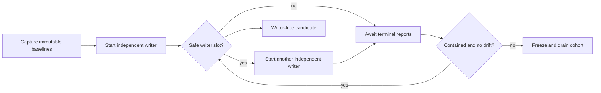
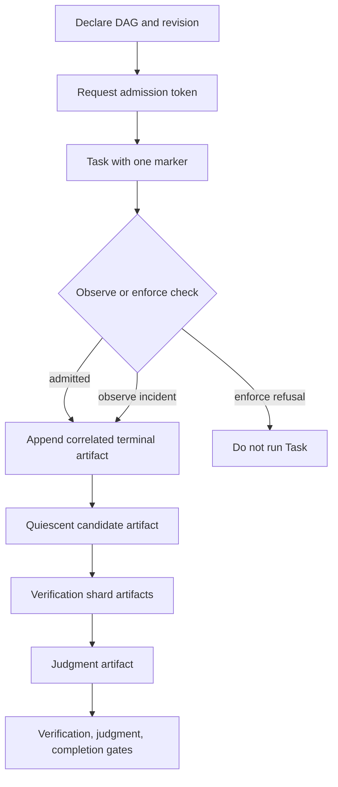
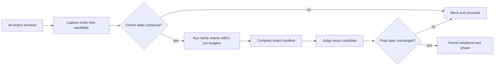

Naru uses Protocol 2 when the scheduler is off. Protocol 3 is selected only in `observe` or `enforce` mode. Both preserve scoped ownership and native Task dispatch. Automatic runs use a combined ten-child pool; a current explicit user request may raise it to fifty. Shared mode permits up to ten writers only when scheduler claims are pairwise disjoint and every writer acquires exact Weaver ownership before editing. Higher writer counts require clean isolated mode with one writer per Naru-owned worktree.

## Protocol 2: rolling cohorts

**Walkthrough:** Protocol 2 is a prompt-level compatibility workflow. Each writer receives immutable run and cohort baselines, an item dispatch observation, and active-peer claims. At most ten independent writers share the workspace when scheduler claims are pairwise disjoint and every writer acquires its exact Weaver claims before editing. A contained terminal report is provisional; uncertainty, overlap, or drift freezes refills and drains active work. Isolated worktree mutations remain root-orchestrator-only, use hook-suppressed tool-owned Git operations, serialize per run, update metadata atomically, and attempt rollback on integration failure; they are path-contained recovery tooling, not a general sandbox or protection from unrelated external workspace mutation.

## Protocol 3: admissions and quality gates

**Walkthrough:** Protocol 3 binds a fresh token to a declared work item, revision, lane, target, claims, and one Task marker. Artifacts correlate reports and the exact candidate. In `observe`, failed admission checks record incidents and fail open; in `enforce`, they fail closed and Protocol 2 is refused. Correlation is not proof that source reports are truthful or that Git state is unchanged.

## Candidate verification

**Walkthrough:** final verification starts only after writers drain. Verify shards cover the exact candidate and may share read-only source paths but not mutable runtime resources. A Judge receives the complete shard manifest, then the coordinator compares a final checkpoint to the judged candidate. Any later change invalidates the verification and judgment.

See [scheduler modes](https://sean35mm.github.io/naru-opencode/runtime/scheduler-modes/) and [limitations](https://sean35mm.github.io/naru-opencode/reference/limitations/) before relying on runtime gates.
