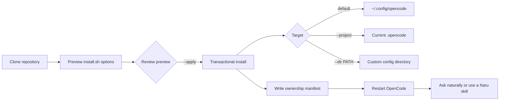

Naru requires OpenCode 1.18.4 or later and Node.js or Bun for the safe installer/doctor. Pull-request review workflows also need authenticated `gh`.



**Walkthrough:** `install.sh` previews by default and does not create the target. After review, add `--apply` with the same options. The installer validates and stages changed assets, preserves conflicts unless explicitly replaced, writes `.naru-install.json`, and skips unchanged paths. Skill and agent Markdown are symlinked by default; executable tools, runtime helpers, plugins, and dashboard code are always copied. Restart OpenCode after an applied change, then make one safe natural request, such as “Use the `naru-plan` skill to plan my objective.”

Naru installs four on-demand skills: `naru-plan`, `naru-impact`, `naru-triage`, and `naru-review`. Skill content remains untrusted guidance and cannot change role, tools, scope, safety, or action authorization; a skill does not grant tools or make an agent read-only. OpenCode controls skill origins and duplicate-name precedence, so verify the selected source when global/project copies overlap. The installer does not mutate global non-Naru agents. Reapply every loaded global/project Naru install to retire healthy manifest-owned legacy definitions, then restart OpenCode. Modified or unowned paths are preserved, reported, and backed up only when the reviewed preview replaces them.

## Install targets

```sh
# Global preview, then apply
./install.sh
./install.sh --apply

# Current project's .opencode preview
./install.sh --project

# Another configuration directory preview
./install.sh --dir /path/to/opencode-config

# Copy Markdown instead of symlinking it
./install.sh --copy

# Apply the full-TUI activity dashboard
./install.sh --apply --with-dashboard

# Replace reviewed unowned/modified managed conflicts exactly once
./install.sh --apply --replace-conflicts
```

`--with-dashboard` safely updates the active TUI configuration and is unavailable under `opencode --mini`. The installer copies the runtime example but does not create or enable `naru-runtime.json`.

Naru's current selected-orchestrator-to-seven-minion design is compatible with OpenCode's default depth of `1`. `--configure-subagent-depth` is accepted as a deprecated no-op for migration compatibility; do not use it in new setup commands. A custom `--dir` must be a path OpenCode actually loads. Restart OpenCode after applying an update.

## Lifecycle and local diagnosis

The versioned ownership manifest records the selected options, source fingerprint, location/mode, and exact managed roots. A repeated matching apply is a no-op and creates no backup. Replaced paths are stored under timestamped `.naru-backups/`; a successful replacement also records a bounded `.naru-transaction.json` receipt in that backup. Backups are retained indefinitely and are never pruned automatically.

Rollback always names one receipt-backed backup; there is no implicit latest selection. Both lifecycle commands preview by default and print a SHA-256 confirmation token bound to the target, action, current manifest, selected receipt, conflict choice, and complete plan:

```sh
# Preview, then restore one successful manifest-owned transaction
./install.sh --rollback 20260722123456-12345
./install.sh --rollback 20260722123456-12345 --apply \
  --confirm-rollback 'sha256:copy-the-current-preview-token'

# Preview, then uninstall exactly the healthy manifest-owned paths shown
./install.sh --uninstall
./install.sh --uninstall --apply \
  --confirm-uninstall 'sha256:copy-the-current-preview-token'
```

Use the same `--project` or `--dir PATH` selector as the install. A changed target or plan invalidates the token. Rollback blocks when a current path differs from the selected transaction. Uninstall removes healthy owned paths but preserves post-install modifications and retains `.naru-install.json` as ownership evidence, producing a partial uninstall. To replace or remove reviewed conflicts, request a new preview with `--replace-conflicts`; that preview has a different token. Unrelated files and backups are never removed.

Lifecycle rollback is deliberately limited to manifest-owned assets and `.naru-install.json`. It does not reverse OpenCode depth changes, TUI registration, or legacy migrations stored beside the same backup. A symlink rollback restores link topology, not older bytes in a source checkout behind a live link. Legacy backup directories without a valid receipt are not inferred. Failed current transactions still roll back automatically.

If a managed path is unowned or differs from its recorded installed fingerprint, install preview labels it as a conflict and apply refuses to replace it. Inspect the bounded conflict list first; `--replace-conflicts` is the exact opt-in for that reviewed operation. Previously owned paths omitted by a changed install option set are preserved.

Run the installed doctor without loading OpenCode plugins:

```sh
# Global
node ~/.config/opencode/tools/naru-doctor.js

# Project
node .opencode/tools/naru-doctor.js --project-root .

# Custom path (loading remains your responsibility)
node /path/to/opencode-config/tools/naru-doctor.js --dir /path/to/opencode-config
```

The report is provider-free, read-only, bounded, and path-sanitized. It reports manifest-backed scopes and source generation, effective global/project depth, OpenCode/runtime compatibility, routing/runtime config state, and dashboard installation/registration. `--source PATH` enables stale-copy comparison when no symlink can identify the source checkout; `--json` emits the same sanitized report as JSON. Custom scopes are reported as explicit but unconfirmed because the doctor cannot prove that OpenCode loads an arbitrary path.

For migration, manual installation, and recovery details, use the canonical [user guide](https://sean35mm.github.io/naru-opencode/user-guide/).
