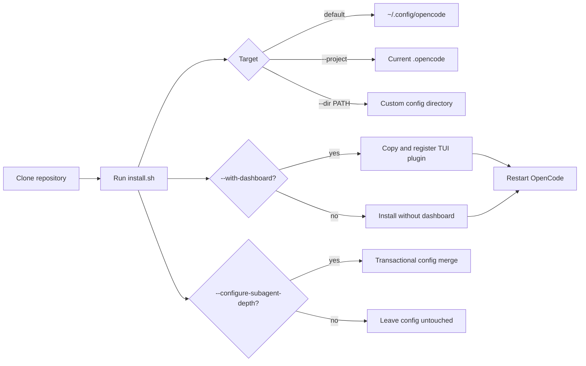

Naru requires OpenCode 1.18.4 or later and an effective top-level `subagent_depth` of at least `2`. Pull-request review workflows also need authenticated `gh`. Node.js or Bun is required when installing the optional dashboard or safely configuring depth.



**Walkthrough:** the installer validates and stages the release before updating managed paths. Markdown commands and agents are symlinked by default; executable tools, runtime helpers, plugins, and dashboard code are always copied. Re-run the installer after updates, then restart OpenCode.

## Install targets

```sh
# Global install (default)
./install.sh

# Current project's .opencode directory
./install.sh --project

# Another configuration directory
./install.sh --dir /path/to/opencode-config

# Copy Markdown instead of symlinking it
./install.sh --copy

# Include the full-TUI activity dashboard
./install.sh --with-dashboard

# Safely create or merge the required depth
./install.sh --configure-subagent-depth
```

`--with-dashboard` safely updates the active TUI configuration and is unavailable under `opencode --mini`. The installer copies the runtime example but does not create or enable `naru-runtime.json`.

OpenCode's omitted/default depth is `1`. Naru's current topology reaches depth `2`, so exactly `2` is recommended. Higher integers are accepted and preserved but do not help Naru; they can broaden unrelated recursion and cost. The installer does not modify OpenCode config unless `--configure-subagent-depth` is explicit. That flag transactionally creates or safely merges the one applicable `opencode.jsonc` or `opencode.json`, with backup and rollback. Project mode uses the project-root config, not `.opencode`, and project values take precedence over global values. A custom `--dir` must be a path OpenCode actually loads. Restart OpenCode after changing depth.

For migration, manual installation, and recovery details, use the canonical [user guide](https://sean35mm.github.io/naru-opencode/user-guide/).
