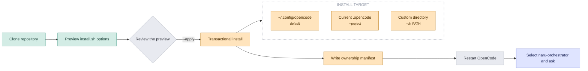

Naru requires OpenCode 1.18.4 or later and Node 24 for the installer and doctor (the installer falls back to Bun when Node is absent). Pull-request workflows also need authenticated `gh`.


```mermaid
flowchart LR
  A["Clone repository"]:::read
  B["Preview install.sh options"]:::read
  C{"Review the preview"}:::gate
  D["Transactional install"]:::write
  I["Write ownership manifest"]:::write
  J["Restart OpenCode"]:::gate
  K["Select naru-orchestrator and ask"]:::entry

  subgraph targets["INSTALL TARGET"]
    direction TB
    F["~/.config/opencode<br/><small>default</small>"]:::write
    G["Current .opencode<br/><small>--project</small>"]:::write
    H["Custom directory<br/><small>--dir PATH</small>"]:::write
  end

  A --> B --> C
  C -->|"--apply"| D
  D --> targets
  D --> I --> J --> K

  style targets fill:none,stroke:#8f96a5,stroke-dasharray:2 3,color:#8f96a5

  classDef entry fill:#dfe4ff,stroke:#3f4fbe,color:#1b2456
  classDef read fill:#d3ece5,stroke:#2f8f78,color:#123a31
  classDef write fill:#ffe4bd,stroke:#b8760f,color:#4a2c00
  classDef gate fill:#e8eaf0,stroke:#8f96a5,color:#22252e
```

<ul class="naru-legend">
  <li data-kind="read">Read-only preview</li>
  <li data-kind="write">Writes to disk</li>
</ul>

Everything left of `--apply` is read-only. `--apply` is the single mutation boundary: nothing is written to disk until you pass it.

**Walkthrough:** `install.sh` previews by default and does not create the target. After reviewing the bounded change summary, repeat the command with `--apply` and the same options. The installer stages changed assets, preserves conflicts unless you explicitly replace them, writes `.naru-install.json`, and skips unchanged paths. Restart OpenCode after an applied change, select `naru-orchestrator`, and ask for something in plain language.

Clone, preview, explicit apply. There is no curl bootstrapper and no package-registry installer.

## What gets installed

- **Agents** — `naru-orchestrator`, `naru-reader`, `naru-reader-deep`, `naru-runner`, `naru-writer`.
- **Skills** — `naru-plan`, `naru-impact`, `naru-triage`, `naru-review`.
- **Tools** — `naru-git-read`, `naru-github-read`, `naru-github-post-review`, `naru-worktree`, `naru-doctor`, plus their shared helper library.
- **`naru-runtime.example.json`** — an example only. The installer never creates or enables `naru-runtime.json`.

Agent and skill Markdown is symlinked by default so a `git pull` in the checkout keeps it current; `--copy` pins copies instead. Executable tools and their helper library are always copied. Naru ships no plugins.

Skill content is advisory guidance. It cannot change role, tools, scope, safety, or action authorization, and it never grants a tool or makes an agent read-only. OpenCode controls skill origins and duplicate-name precedence, so check which source is selected when global and project copies overlap. The installer does not modify non-Naru agents.

## Install targets

```sh
# Global preview, then apply
sh install.sh --preview
sh install.sh --apply

# Current project's .opencode
sh install.sh --project

# Another configuration directory
sh install.sh --dir /path/to/opencode-config

# Copy Markdown instead of symlinking it
sh install.sh --copy

# Replace reviewed unowned/modified managed conflicts exactly once
sh install.sh --apply --replace-conflicts
```

A custom `--dir` must be a path OpenCode actually loads. Restart OpenCode after applying an update.

Naru's topology — one orchestrator over leaf subagents — works at OpenCode's default `subagent_depth` of `1`. `--configure-subagent-depth` and `--with-dashboard` are accepted as deprecated no-ops for migration compatibility; do not use them in new setup commands.

## Lifecycle and rollback

The versioned ownership manifest records the selected options, source fingerprint, location/mode, and the exact managed roots. A repeated matching apply is a no-op and creates no backup. Replaced paths are stored under timestamped `.naru-backups/`; a successful replacement also records a bounded `.naru-transaction.json` receipt in that backup. Backups are retained indefinitely and are never pruned automatically.

Rollback always names one receipt-backed backup; there is no implicit latest selection. Both lifecycle commands preview by default and print a SHA-256 confirmation token bound to the target, action, current manifest, selected receipt, conflict choice, and complete plan:

```sh
# Preview, then restore one successful manifest-owned transaction
sh install.sh --rollback 20260722123456-12345
sh install.sh --rollback 20260722123456-12345 --apply \
  --confirm-rollback 'sha256:copy-the-current-preview-token'

# Preview, then uninstall exactly the healthy manifest-owned paths shown
sh install.sh --uninstall
sh install.sh --uninstall --apply \
  --confirm-uninstall 'sha256:copy-the-current-preview-token'
```

Use the same `--project` or `--dir PATH` selector as the install. A changed target or plan invalidates the token. Rollback blocks when a current path differs from the selected transaction. Uninstall removes healthy owned paths but preserves post-install modifications and retains `.naru-install.json` as the ownership record, producing a partial uninstall. To replace or remove reviewed conflicts, request a new preview with `--replace-conflicts`; that preview has a different token. Unrelated files and backups are never removed.

Rollback is deliberately limited to manifest-owned assets and `.naru-install.json`. A symlink rollback restores link topology, not older bytes in a source checkout behind a live link. Legacy backup directories without a valid receipt are not inferred. A failed current transaction still rolls back automatically.

If a managed path is unowned or differs from its recorded installed fingerprint, install preview labels it a conflict and apply refuses to replace it. Inspect the bounded conflict list first; `--replace-conflicts` is the exact opt-in for that reviewed operation. Previously owned paths omitted by a changed option set are preserved.

## Doctor

Run the installed doctor for a local health report. It loads no OpenCode plugins and contacts no provider:

```sh
# Global
node ~/.config/opencode/tools/naru-doctor.js

# Project
node .opencode/tools/naru-doctor.js --project-root .

# Custom path (loading remains your responsibility)
node /path/to/opencode-config/tools/naru-doctor.js --dir /path/to/opencode-config
```

The report is read-only, bounded, and path-sanitized. It covers OpenCode and runtime compatibility, effective `subagent_depth`, each manifest-backed scope with its location/install mode and source version, asset health, runtime-config state including the effective workspace mode, and any issue paths. `--source PATH` enables stale-copy comparison when no symlink identifies the source checkout; `--json` emits the same sanitized report as JSON. Custom scopes are reported as explicit but unconfirmed, because the doctor cannot prove that OpenCode loads an arbitrary path.

## Optional runtime configuration

`naru-runtime.json` is optional and never created for you. Copy `naru-runtime.example.json` next to it in the same configuration directory if you want to change the defaults; see the [runtime configuration reference](/naru-opencode/reference/runtime-config/) for the full schema.

For operational detail and recovery procedures, see the canonical [user guide](/naru-opencode/user-guide/).
