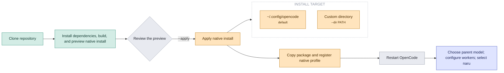

The normal native install requires **exactly OpenCode 2.0.15** on `PATH` and Node 24. Install OpenCode separately: Naru does not manage its binary or a broker. Pull-request workflows also need authenticated `gh`. Recognizing 2.0.15 does not establish provider entitlement or a qualified cross-platform release.

## Quick install

```sh
curl -fsSL https://raw.githubusercontent.com/sean35mm/naru-opencode/main/bootstrap.sh | sh
naru install
```

The bootstrap downloads a checksum-verified release into `~/.naru` and installs exactly one file, the `naru` command. It does not read or modify your OpenCode configuration, and it will not edit a shell profile unless you pass `--modify-path` — otherwise it prints the `PATH` line and leaves the decision to you.

Everything that changes your OpenCode configuration goes through preview first. `naru install` shows the change summary and asks before applying in a terminal; pass `--apply` for an explicit non-interactive install. The default target is `~/.config/opencode`; `--dir PATH` selects an exact custom config directory, which you must ensure OpenCode loads.

| Command | Effect |
| --- | --- |
| `naru install [--dir PATH]` | Preview native install, then ask in a terminal |
| `naru upgrade [--dir PATH]` | Fetch the latest release, then preview native install |
| `naru doctor [--dir PATH] [--json]` | Read-only local native package and registration health |
| `naru configure [--dir PATH] [--apply]` | Select native worker models interactively; preview unless applied |
| `naru models --list [--dir PATH]` | List native worker references without changing them |
| `naru models --set REF[,REF] [--dir PATH] [--apply]` | Preview or save exact worker references offline; checks syntax, duplicates, and the 32-reference limit, not availability |
| `naru version` | Show installed and latest available versions |

Releases live under `~/.naru/versions/<version>` with `~/.naru/current` pointing at the active one, so an upgrade keeps the previous release on disk. To install an exact version, pass `--version` to the bootstrap:

```sh
curl -fsSL https://raw.githubusercontent.com/sean35mm/naru-opencode/main/bootstrap.sh | sh -s -- --version v0.2.0
```

## Install from a clone

Contributors and anyone who prefers to read the source first can skip the bootstrap and run the native installer directly.

```sh
git clone https://github.com/sean35mm/naru-opencode.git
cd naru-opencode
npm ci
npm run build
sh install.sh --preview
sh install.sh --apply
```


```mermaid
flowchart LR
  A["Clone repository"]:::read
  B["Install dependencies, build, and preview native install"]:::read
  C{"Review the preview"}:::gate
  D["Apply native install"]:::write
  I["Copy package and register native profile"]:::write
  J["Restart OpenCode"]:::gate
  K["Choose parent model; configure workers; select naru"]:::entry

  subgraph targets["INSTALL TARGET"]
    direction TB
    F["~/.config/opencode<br/><small>default</small>"]:::write
    H["Custom directory<br/><small>--dir PATH</small>"]:::write
  end

  A --> B --> C
  C -->|"--apply"| D
  D --> targets
  D --> I --> J --> K

  style targets fill:none,stroke:#8f96a5,stroke-dasharray:2 3,color:#8f96a5

  classDef entry fill:#dfe4ff,stroke:#3f4fbe,color:#1b2456
  classDef read fill:#d3ece5,stroke:#2f8f78,color:#123a31
  classDef write fill:#ffe4bd,stroke:#b8760f,color:#4a2c00
  classDef gate fill:#e8eaf0,stroke:#8f96a5,color:#22252e
```

<ul class="naru-legend">
  <li data-kind="read">Read-only preview</li>
  <li data-kind="write">Writes to disk</li>
</ul>

The direct `install.sh` preview does not write the target. Review it before passing `--apply`; the `naru` front door can instead ask for confirmation in a terminal.

**Walkthrough:** `install.sh` previews by default and does not create the target. Repeat with `--apply` and the same options after review. The normal install copies the compiled package to `.naru-native/package`, writes `.naru-native/profile.json`, `ownership.json`, and `manifest.json`, and registers the plugin, skills, and primary `naru` agent in `opencode.json`. It preserves unrelated config and does not override your parent model or variant. Restart OpenCode after applying, choose your parent model in OpenCode, then select workers explicitly with `naru configure --apply` or `naru models --set provider/model#variant[,REF] --apply`. Without a selected worker pool, the primary can still be present, but delegated model-specific workers are not configured.

The native installer requires strict JSON in `opencode.json`. It refuses `opencode.jsonc`, ambiguous or unsafe config, historical v1 command/plugin collisions, and an existing `.naru-install.json`; it does not automatically cut over or delete v1 data. Inspect collisions and plan any cleanup separately. Do not print configuration or authentication content while diagnosing them. No historical OC2 model pool is imported by the normal installer.

## What gets installed

- **Native package** — copied compiled tools, the Naru plugin and seven skills, including `naru-coordinate`, `naru-select-workers`, and `naru-evaluate`.
- **OpenCode registration** — `naru` primary agent, Naru plugin and skills paths, and worker definitions only for explicitly selected models.
- **Ownership** — private `.naru-native` profile, manifest, and managed-agent record.

The native package is copied, not symlinked. A checkout update does not change installed code until another reviewed apply.

Skill content is advisory guidance. It cannot change role, tools, scope, safety, or action authorization, and it never grants a tool or makes an agent read-only. OpenCode controls skill origins and duplicate-name precedence, so check which source is selected when global and project copies overlap. The installer does not modify non-Naru agents.

## Native install targets

```sh
# Global preview, then apply
sh install.sh --preview
sh install.sh --apply

# Another configuration directory
sh install.sh --dir /path/to/opencode-config
sh install.sh --dir /path/to/opencode-config --apply
```

A custom `--dir` must be a path OpenCode actually loads. Restart OpenCode after applying an update.

`--project`, `--copy`, `--replace-conflicts`, and `--only` belong to the historical v1 installer, not normal native installation. Interactive `naru configure` uses OpenCode's normal catalogue to offer choices. Explicit `naru models --set` validates reference syntax, duplicates, and the 32-reference limit offline, then previews or saves the exact references; availability is not checked. Neither command enables a paid provider or guarantees account access.

## Historical v1 lifecycle and rollback (`--legacy`)

The remaining lifecycle commands operate **only** on the historical v1 installation. Invoke `sh install.sh --legacy ...` (or `naru install --legacy`); native uninstall and rollback are not implemented. Do not use v1 lifecycle commands as an automatic native migration or remove old user data to make a native install pass.

The versioned ownership manifest records the selected options, source fingerprint, location/mode, and the exact managed roots. A repeated matching apply is a no-op and creates no backup. Replaced paths are stored under timestamped `.naru-backups/`; a successful replacement also records a bounded `.naru-transaction.json` receipt in that backup. Backups are retained indefinitely and are never pruned automatically.

Rollback always names one receipt-backed backup; there is no implicit latest selection. Both lifecycle commands preview by default and print a SHA-256 confirmation token bound to the target, action, current manifest, selected receipt, conflict choice, and complete plan:

```sh
# Preview, then restore one successful manifest-owned transaction
sh install.sh --legacy --rollback 20260722123456-12345
sh install.sh --legacy --rollback 20260722123456-12345 --apply \
  --confirm-rollback 'sha256:copy-the-current-preview-token'

# Preview, then uninstall exactly the healthy manifest-owned paths shown
sh install.sh --legacy --uninstall
sh install.sh --legacy --uninstall --apply \
  --confirm-uninstall 'sha256:copy-the-current-preview-token'
```

Use the same `--project` or `--dir PATH` selector as the install. A changed target or plan invalidates the token. Rollback blocks when a current path differs from the selected transaction. Uninstall removes healthy owned paths but preserves post-install modifications and retains `.naru-install.json` as the ownership record, producing a partial uninstall. To replace or remove reviewed conflicts, request a new preview with `--replace-conflicts`; that preview has a different token. Unrelated files and backups are never removed.

Rollback is deliberately limited to manifest-owned assets and `.naru-install.json`. A symlink rollback restores link topology, not older bytes in a source checkout behind a live link. Legacy backup directories without a valid receipt are not inferred. A failed current transaction still rolls back automatically.

If a managed path is unowned or differs from its recorded installed fingerprint, install preview labels it a conflict and apply refuses to replace it. Inspect the bounded conflict list first; `--replace-conflicts` is the exact opt-in for that reviewed operation. Previously owned paths omitted by a changed option set are preserved.

## Doctor

Run the normal native doctor for local inspection. It does not load plugins, contact a provider, test live agent invocation, or establish account entitlement:

```sh
naru doctor
naru doctor --dir /path/to/opencode-config --json
```

The native report checks the exact host version, local package inventory, managed agents, registration, and worker count. `runtimeEvidence: not-run` is intentional. For the historical v1 manifest, depth and runtime checks, run `naru doctor --legacy` instead.

## Historical v1 optional runtime configuration

The v1 `naru-runtime.json` is optional and not part of normal native setup. See the [runtime configuration reference](/naru-opencode/reference/runtime-config/) for the historical schema.

For operational detail and recovery procedures, see the canonical [user guide](/naru-opencode/user-guide/).
