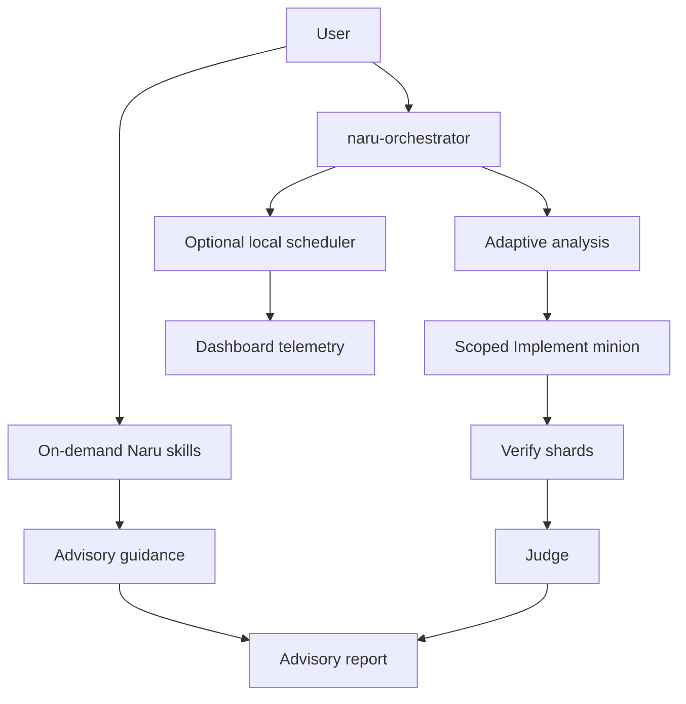

Naru adds read-only analysis, scoped implementation, verification, judgment, optional local scheduler gates, and a terminal activity view to [OpenCode](https://opencode.ai).

Start with the [quickstart](https://sean35mm.github.io/naru-opencode/getting-started/quickstart/) or the detailed [user guide](https://sean35mm.github.io/naru-opencode/user-guide/). For a safety-first view of the runtime, read [scheduler modes](https://sean35mm.github.io/naru-opencode/runtime/scheduler-modes/) and [limitations](https://sean35mm.github.io/naru-opencode/reference/limitations/).

## How the pieces fit

**Walkthrough:** Four on-demand skills provide plan, impact, triage, or dry-run review guidance. For implementation, the selected orchestrator chooses useful optional lenses and delegates only to its seven minions; scoped edits go only to Implement, followed by Verify and Judge. The optional scheduler observes or gates declared Task admissions; the dashboard displays local activity and telemetry.

## Choose a path

- **Install Naru:** [installation](https://sean35mm.github.io/naru-opencode/getting-started/installation/)
- **Understand delegation:** [adaptive delegation](https://sean35mm.github.io/naru-opencode/concepts/adaptive-delegation/) and [protocols](https://sean35mm.github.io/naru-opencode/concepts/protocols/)
- **Configure the runtime:** [scheduler modes](https://sean35mm.github.io/naru-opencode/runtime/scheduler-modes/) and [runtime configuration](https://sean35mm.github.io/naru-opencode/reference/runtime-config/)
- **Use a review safely:** [review lane](https://sean35mm.github.io/naru-opencode/workflows/review-lane/)
- **Integrate another agent:** [agent workflows](https://sean35mm.github.io/naru-opencode/workflows/agents/) and the canonical [integration guide](https://sean35mm.github.io/naru-opencode/agent-integration/)

The detailed [user guide](https://sean35mm.github.io/naru-opencode/user-guide/), [development guide](https://sean35mm.github.io/naru-opencode/development/), and [agent integration guide](https://sean35mm.github.io/naru-opencode/agent-integration/) remain the canonical references.
