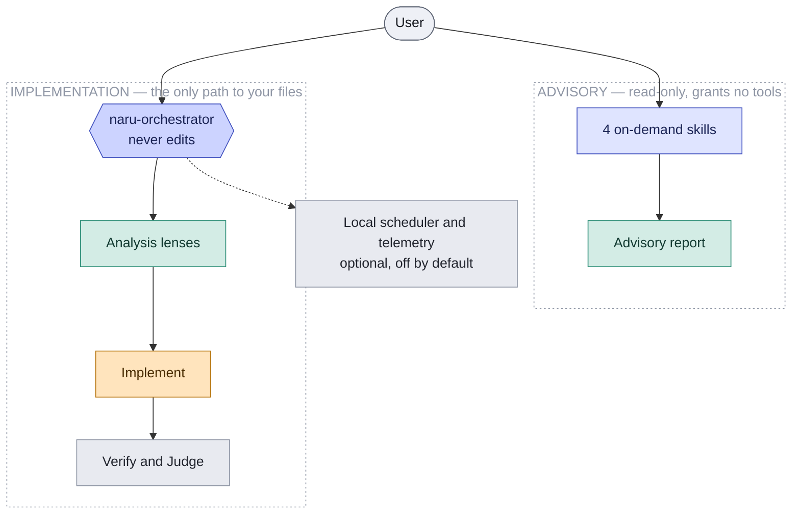

## How the pieces fit

Naru has two lanes. Advisory skills only ever return guidance. The implementation lane is the only path that reaches your files, and within it exactly one agent — the Implement minion — is permitted to write. A local scheduler and telemetry are optional and off by default.

<ul class="naru-legend">
  <li data-kind="read">Read-only</li>
  <li data-kind="write">Writes files</li>
  <li data-kind="gate">Gate</li>
</ul>

This colour vocabulary is used in every diagram across these docs: teal is read-only, amber writes to your workspace, red marks something that is refused or explicitly unproven.

  <a class="naru-card" href="/naru-opencode/getting-started/quickstart/">
    01 — START
    
Quickstart

    
Preview the install, apply it, then take exactly one safe first action.

  </a>
  <a class="naru-card" href="/naru-opencode/concepts/adaptive-delegation/">
    02 — CONCEPTS
    
Adaptive delegation

    
How the orchestrator picks analysis lenses, and which of the seven minions may write.

  </a>
  <a class="naru-card" href="/naru-opencode/runtime/scheduler-modes/">
    03 — RUNTIME
    
Scheduler modes

    
Off, observe, or enforce — and what each mode does and does not guarantee.

  </a>
  <a class="naru-card" href="/naru-opencode/reference/limitations/">
    04 — BOUNDARIES
    
Limitations

    
What Naru enforces, what it merely advises, and what it never claims to prove.

  </a>

## Canonical references

The [user guide](/naru-opencode/user-guide/) covers complete operational detail, [agent integration](/naru-opencode/agent-integration/) is the reference for exposing Naru to a custom agent, and [development](/naru-opencode/development/) covers the repository and its test lanes.
