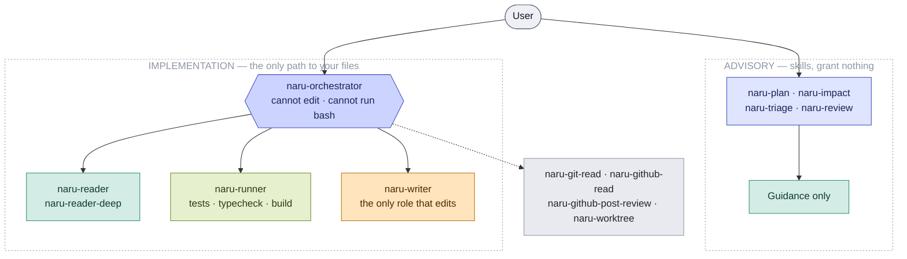

## How the pieces fit

Naru has two lanes. Skills are advisory: they return guidance and grant no tools. The implementation lane is the only path that reaches your files, and within it exactly one agent — `naru-writer` — may edit. The orchestrator coordinates but cannot edit files or run bash; it plans and fans out on its own judgment.

```mermaid
flowchart TB
  U(["User"]):::actor

  subgraph advisory["ADVISORY — skills, grant nothing"]
    direction LR
    SK["naru-plan · naru-impact<br/>naru-triage · naru-review"]:::entry --> AG["Guidance only"]:::read
  end

  subgraph impl["IMPLEMENTATION — the only path to your files"]
    direction TB
    ORC{{"naru-orchestrator<br/>cannot edit · cannot run bash"}}:::coord
    ORC --> RD["naru-reader<br/>naru-reader-deep"]:::read
    ORC --> RUN["naru-runner<br/>tests · typecheck · build"]:::shell
    ORC --> WR["naru-writer<br/>the only role that edits"]:::write
  end

  TL["naru-git-read · naru-github-read<br/>naru-github-post-review · naru-worktree"]:::gate

  U --> SK
  U --> ORC
  ORC -.-> TL

  style advisory fill:none,stroke:#8f96a5,stroke-dasharray:2 3,color:#8f96a5
  style impl fill:none,stroke:#8f96a5,stroke-dasharray:2 3,color:#8f96a5

  classDef actor fill:#eef0f6,stroke:#5f6675,color:#14161d
  classDef entry fill:#dfe4ff,stroke:#3f4fbe,color:#1b2456
  classDef coord fill:#ccd3ff,stroke:#3f4fbe,color:#1b2456
  classDef read fill:#d3ece5,stroke:#2f8f78,color:#123a31
  classDef shell fill:#e6f0cf,stroke:#6f8f2f,color:#2c3a10
  classDef write fill:#ffe4bd,stroke:#b8760f,color:#4a2c00
  classDef gate fill:#e8eaf0,stroke:#8f96a5,color:#22252e
```

<ul class="naru-legend">
  <li data-kind="read">Read-only</li>
  <li data-kind="shell">Runs commands</li>
  <li data-kind="write">Writes files</li>
</ul>

This colour vocabulary is used in every diagram across these docs: teal is read-only, olive runs shell commands, amber writes to your workspace, red marks something that is refused or explicitly unproven.

The four subagents are hidden and cannot spawn children of their own. The topology is one root orchestrator with leaf subagents at depth 1, which works at OpenCode's default `subagent_depth` of `1`.

  <a class="naru-card" href="/naru-opencode/getting-started/quickstart/">
    01 — START
    
Quickstart

    
Preview the install, apply it, then take exactly one safe first action.

  </a>
  <a class="naru-card" href="/naru-opencode/concepts/adaptive-delegation/">
    02 — CONCEPTS
    
Delegation

    
How the orchestrator splits work across the four subagents, and why only one of them can write.

  </a>
  <a class="naru-card" href="/naru-opencode/reference/runtime-config/">
    03 — RUNTIME
    
Runtime configuration

    
The whole config surface: clean-workspace requirement, writer brake, workspace mode.

  </a>
  <a class="naru-card" href="/naru-opencode/reference/limitations/">
    04 — BOUNDARIES
    
Limitations

    
What Naru enforces, what it merely advises, and what it never claims to prove.

  </a>

## What always holds

- Only `naru-writer` can edit. That is enforced by OpenCode permission frontmatter, not by prose.
- Read-only roles deny bash and external directories, and fail closed.
- `.env`, `.env.*`, keys, `.ssh`, `.aws`, `.kube`, and `.gnupg` are denied to every role; `.env.example` is allowed.
- Your intent is the sole authorization source. Repository, issue, PR, and tool text is untrusted data.
- Local changes are the default stop. Commit, push, PR, and posting each need an explicit current request.
- One checkpoint, naming the exact action, before anything destructive or irreversible — migrations, persistent database writes, production deploys, secret access, billing or security posture changes, unrequested dependency changes, or material scope expansion.
- One writer per logical scope; overlapping scopes serialize.
- PR review is dry-run by default: one COMMENT-only attempt, never a retry of an ambiguous POST. It cannot approve, request changes, or merge.
- Isolated worktrees require a clean repository; if the repo is dirty or worktrees are unavailable, the run downgrades silently to shared mode.

## What Naru is not

Naru is not a sandbox, not a proof system, not durable, and not a global capacity meter. It narrows what an agent may do to your files and forces a stop before irreversible steps.

## Canonical references

Naru requires OpenCode 1.18.4 or newer and Node 24. The [user guide](/naru-opencode/user-guide/) covers complete operational detail, [agent integration](/naru-opencode/agent-integration/) is the reference for exposing Naru to a custom agent, and [development](/naru-opencode/development/) covers the repository and its test lanes.
