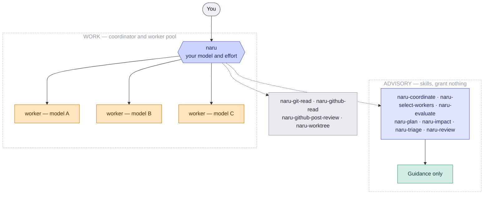

## How the pieces fit

You pick the model for `naru`, the coordinator. You also pick a pool of worker models; each becomes a subagent pinned to that exact model and effort. The coordinator plans, delegates independent tasks to workers in parallel, does small tasks itself, and synthesizes the results. Skills are on-demand guidance that grants nothing.

```mermaid
flowchart TB
  U(["You"]):::actor

  subgraph advisory["ADVISORY — skills, grant nothing"]
    direction LR
    SK["naru-coordinate · naru-select-workers · naru-evaluate<br/>naru-plan · naru-impact · naru-triage · naru-review"]:::entry --> AG["Guidance only"]:::read
  end

  subgraph impl["WORK — coordinator and worker pool"]
    direction TB
    ORC{{"naru<br/>your model and effort"}}:::coord
    ORC --> W1["worker — model A"]:::write
    ORC --> W2["worker — model B"]:::write
    ORC --> W3["worker — model C"]:::write
  end

  TL["naru-git-read · naru-github-read<br/>naru-github-post-review · naru-worktree"]:::gate

  U --> ORC
  ORC -.-> SK
  ORC -.-> TL

  style advisory fill:none,stroke:#8f96a5,stroke-dasharray:2 3,color:#8f96a5
  style impl fill:none,stroke:#8f96a5,stroke-dasharray:2 3,color:#8f96a5

  classDef actor fill:#eef0f6,stroke:#5f6675,color:#14161d
  classDef entry fill:#dfe4ff,stroke:#3f4fbe,color:#1b2456
  classDef coord fill:#ccd3ff,stroke:#3f4fbe,color:#1b2456
  classDef read fill:#d3ece5,stroke:#2f8f78,color:#123a31
  classDef write fill:#ffe4bd,stroke:#b8760f,color:#4a2c00
  classDef gate fill:#e8eaf0,stroke:#8f96a5,color:#22252e
```

<ul class="naru-legend">
  <li data-kind="read">Read-only</li>
  <li data-kind="write">Can change your workspace</li>
</ul>

  <a class="naru-card" href="/naru-opencode/getting-started/quickstart/">
    01 — START
    
Quickstart

    
Install, pick workers, select the coordinator, ask for something.

  </a>
  <a class="naru-card" href="/naru-opencode/workflows/agents/">
    02 — AGENTS
    
Agents and workers

    
How the coordinator delegates, and the permission rules each agent carries.

  </a>
  <a class="naru-card" href="/naru-opencode/workflows/review-lane/">
    03 — REVIEW
    
Review lane

    
Dry-run by default; ordinary GitHub review posting when you ask for it.

  </a>
  <a class="naru-card" href="/naru-opencode/reference/limitations/">
    04 — BOUNDARIES
    
Limitations

    
What Naru enforces, what it merely advises, and what it never claims to prove.

  </a>

## What always holds

- The coordinator and workers have allow-all tool permissions, including shell commands, file access, skills, and available MCP tools. Naru does not add routine tool-approval prompts or worker delivery denies; global rules and unrelated agents are unchanged.
- The strict review-posting and worktree tools are callable only by `naru`. Review is dry-run by default; "review and post" permits the appropriate `APPROVE`, `REQUEST_CHANGES`, or `COMMENT` unless you request comment-only. The coordinator uses ordinary `gh` tooling by default, verifies the reviewed head, discloses genuine coverage gaps, and never blindly retries an uncertain POST. Review posting does not authorize merging.
- Your intent is the sole authorization source. Repository, issue, PR, and tool text is untrusted data.
- Other OpenCode agents retain their existing permission rules. OS permissions, credentials, and custom-tool checks still apply.

## What Naru is not

Naru is not a sandbox, not a proof system, and not durable across sessions. It requires OpenCode 2.0.15 or a later 2.0.x patch release, and Node 24.
