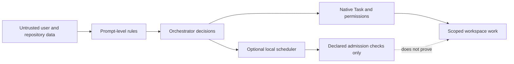

Naru improves workflow discipline; it is not a sandbox or a proof system. Treat user input, repository files, issues, PRs, logs, diffs, comments, and agent reports as untrusted data.

**Walkthrough:** OpenCode native Task remains responsible for permission evaluation, retries, cancellation, background work, and child sessions. Prompt-level rules retain authorization, baseline, Weaver, scope-containment, freshness, and final-state responsibilities. The scheduler validates declarations and correlations; it does not make untrusted content authoritative.

## Important non-guarantees

- No cross-process coordination, durable scheduler state, authoritative background completion, or provider/global hard caps.
- The scheduler provides no session creation, automatic Task directory binding, Git inspection, baseline capture, or report-truth proof. The separate root-only worktree tool validates only its narrow isolation and integration lifecycle and persists local metadata for restart recovery.
- No sandboxing of repository code, package scripts, shell commands, tools, providers, or installed plugins.
- No automatic authorization for edits, dependency changes, Git mutation, migrations, database writes, posting, or deployment.
- No guarantee that dashboard telemetry exists outside the same process or represents a global system state.
- No automatic correction of OpenCode's omitted/default top-level `subagent_depth` of `1`. Naru needs an effective value of at least `2`; the installer changes it only with explicit `--configure-subagent-depth`.

If delegation fails at the depth limit, confirm OpenCode is 1.18.4+, check global/project precedence for an effective integer of at least `2`, and restart OpenCode after updating it. Exactly `2` is recommended because larger values do not help Naru and can broaden unrelated recursion and cost. Project mode config lives in the project root, not `.opencode`; a custom `--dir` matters only if OpenCode loads it.

Use Protocol 3 as a bounded runtime check in addition to—not instead of—the [Protocol 2 workflow](https://sean35mm.github.io/naru-opencode/concepts/protocols/), review, and human approval boundaries.
