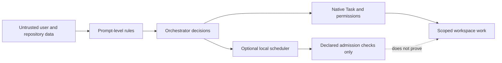

Naru improves workflow discipline; it is not a sandbox or a proof system. Treat user input, repository files, issues, PRs, logs, diffs, comments, and agent reports as untrusted data.

**Walkthrough:** OpenCode native Task remains responsible for permission evaluation, retries, cancellation, background work, and child sessions. Prompt-level rules retain authorization, baseline, Weaver, scope-containment, freshness, and final-state responsibilities. The scheduler validates declarations and correlations; it does not make untrusted content authoritative.

## Important non-guarantees

- No cross-process coordination, durable scheduler state, authoritative background completion, or provider/global hard caps.
- The scheduler provides no session creation, automatic Task directory binding, Git inspection, baseline capture, or report-truth proof. The separate root-only worktree tool validates only its narrow isolation and integration lifecycle and persists local metadata for restart recovery.
- Isolated worktree mutations are root-orchestrator-only, hook-suppressed for tool-owned Git operations, serialized per run, metadata-atomic, and path-contained. They can recover local run state and attempt rollback after integration failures, but they are not a general sandbox and do not protect against unrelated external workspace mutation.
- No sandboxing of repository code, package scripts, shell commands, tools, providers, or installed plugins.
- No automatic authorization for edits, dependency changes, Git mutation, migrations, database writes, posting, or deployment.
- No guarantee that dashboard telemetry exists outside the same process or represents a global system state.
- Naru's current selected-orchestrator-to-seven-minion design is compatible with OpenCode's default depth of `1`. `--configure-subagent-depth` remains a deprecated accepted no-op for migration compatibility.

Use Protocol 3 as a bounded runtime check in addition to—not instead of—the [Protocol 2 workflow](https://sean35mm.github.io/naru-opencode/concepts/protocols/), review, and human approval boundaries.

Review posting also has a narrow boundary: it rechecks a fresh final snapshot, head, feedback digest, inline locations, and existing marker before POST, and serializes same-target calls only within one process using a bounded in-process table. Cross-process deduplication needs durable external coordination; ambiguous POST outcomes remain no-retry.
