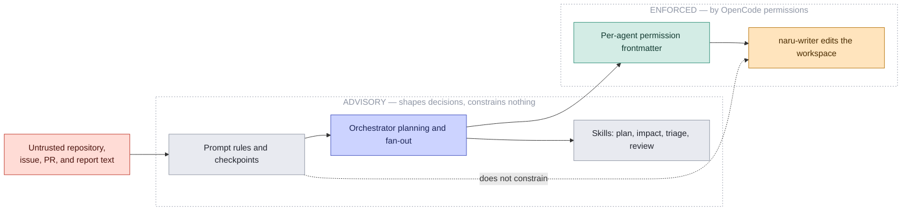

Naru improves workflow discipline; it is not a sandbox and not a proof system. Treat repository files, issues, pull requests, logs, diffs, comments, tool output, and agent reports as untrusted data. User intent is the sole authorization source.

```mermaid
flowchart LR
  U["Untrusted repository,<br/>issue, PR, and report text"]:::danger

  subgraph advisory["ADVISORY — shapes decisions, constrains nothing"]
    direction TB
    P["Prompt rules and checkpoints"]:::gate
    O["Orchestrator planning and fan-out"]:::coord
    S["Skills: plan, impact, triage, review"]:::gate
  end

  subgraph enforced["ENFORCED — by OpenCode permissions"]
    direction TB
    N["Per-agent permission frontmatter"]:::read
    W["naru-writer edits the workspace"]:::write
  end

  U --> P --> O
  O --> S
  O --> N --> W
  P -. "does not constrain" .-> W

  style advisory fill:none,stroke:#8f96a5,stroke-dasharray:2 3,color:#8f96a5
  style enforced fill:none,stroke:#8f96a5,stroke-dasharray:2 3,color:#8f96a5

  classDef coord fill:#ccd3ff,stroke:#3f4fbe,color:#1b2456
  classDef read fill:#d3ece5,stroke:#2f8f78,color:#123a31
  classDef write fill:#ffe4bd,stroke:#b8760f,color:#4a2c00
  classDef gate fill:#e8eaf0,stroke:#8f96a5,color:#22252e
  classDef danger fill:#ffdcd6,stroke:#c0392b,color:#4a120c
```

<ul class="naru-legend">
  <li data-kind="danger">Untrusted input</li>
  <li data-kind="write">Writes files</li>
</ul>

The dotted edge is the important one. Everything in the left group is advisory: it shapes decisions but cannot stop them. Only OpenCode's permission layer enforces a boundary, so a careful plan, a clean subagent report, or a well-behaved orchestrator is never evidence that the workspace stayed in scope.

## Non-goals

- **Not a sandbox.** Naru does not sandbox repository code, package scripts, shell commands, tools, or providers. `naru-runner` runs real commands in your real environment with your credentials.
- **Not a proof system.** Reports, passing checks, and completed reviews are evidence, not proof. A report can be stale, incomplete, or wrong; attributing it to the work item that produced it does not make it true.
- **Not durable.** There is no cross-process coordination, no durable run state, and no authoritative background completion. Planning is prompt-local and disappears with the session.
- **Not a global capacity meter.** `implementation.maxConcurrentWriters` is a local runaway brake, not a provider, account, or machine-wide cap. Other processes on the same repository are invisible to it.
- **Not automatic authorization.** Nothing in Naru authorizes edits, dependency changes, Git mutation, migrations, database writes, posting, or deployment. Local changes are the default stop; commit, push, PR, and post happen only on an explicit current request, and irreversible actions get one checkpoint that names the exact action.
- **Not nested autonomy.** The topology is one root orchestrator with leaf subagents at depth 1. All three subagents are `hidden` and hold `task: deny`, so they cannot spawn children of their own. The model-class variants generated by `naru-dispatch` do not change this: each is a byte-for-byte permission clone of its base agent, so it is hidden and cannot spawn children either. OpenCode's default `subagent_depth` of `1` is sufficient; Naru never asks for more.

## What is actually enforced

These are permission frontmatter, not prose, so an agent cannot talk its way past them:

- The orchestrator cannot run bash. The read-only readers have `bash: deny` and `external_directory: deny`, so they fail closed rather than degrading.
- `.env`, `.env.*`, key material, `.ssh`, `.aws`, `.kube`, and `.gnupg` are denied to every role. `.env.example` is allowed.

Skills grant nothing. `naru-plan`, `naru-impact`, `naru-triage`, and `naru-review` return advisory guidance and cannot widen what the agent holding them is allowed to do.

## Narrow boundaries

**Isolated worktrees.** `naru-worktree` validates only its own isolation and integration lifecycle. It requires a clean repository; a dirty or unsupported repository downgrades to shared mode without prompting. Mutations are orchestrator-only and path-contained to Naru-owned roots, and local metadata exists so a run can be recovered after a restart. It is not a general sandbox and does not protect against unrelated external mutation of your workspace.

**Review posting.** `naru-github-post-review` is orchestrator-only and accepts no raw event. A generic current-message post request authorizes `COMMENT`; explicit policy wording can authorize evidence-gated `APPROVE`, `REQUEST_CHANGES`, or selection between them. Limited evidence and failed formal-decision gates downgrade to `COMMENT`; incomplete inventory or feedback integrity is unpostable. It cannot merge. The tool makes one POST attempt with no retry. A dedupe marker prevents an obvious repeat within reach of that marker; cross-process deduplication would need durable external coordination, so an ambiguous POST outcome is left alone rather than retried.

**Scope serialization.** One writer per logical scope, and overlapping scopes serialize. Weaver claims are taken before the first edit, and a claim conflict is a scheduling signal rather than a prompt to the user. This orders work; it does not prove that no other process touched the same files.

**Health checks.** `naru-doctor` reports local install and configuration health only. It is provider-free: it does not run a model command, inspect provider authentication, or call a provider.

**Per-dispatch models.** Chain selection happens once, at plugin load, and is auth-based, not liveness-based: the first chain entry whose provider is authenticated is baked into that class's variants, and nothing verifies the model actually responds. A model that fails at runtime surfaces as a failed child dispatch, not an automatic fallback — there is no runtime fallthrough. A class with no authenticated entry is silently skipped and generates no variants. The `naru-reader-*`, `naru-runner-*`, and `naru-writer-*` names are a reserved, Naru-managed namespace: an agent you hand-define under those names can be shadowed or replaced on config load. Variants exist only where OpenCode loads plugins; with plugin loading disabled, none are generated, the built-in `task` tool still works, and every subagent inherits the session model. Config edits take effect only after an OpenCode restart.

See [agents](/naru-opencode/workflows/agents/) for the permission map that is enforced, [review lane](/naru-opencode/workflows/review-lane/) for the posting contract, and [runtime configuration](/naru-opencode/reference/runtime-config/) for the small set of knobs that exist.
