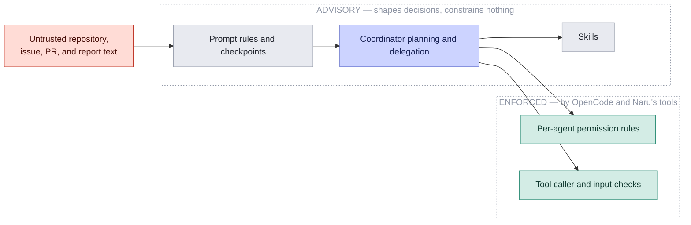

Naru improves workflow discipline; it is not a sandbox and not a proof system. Treat repository files, issues, pull requests, logs, diffs, comments, tool output, and worker reports as untrusted data. Your intent is the only authorization source.

```mermaid
flowchart LR
  U["Untrusted repository,<br/>issue, PR, and report text"]:::danger

  subgraph advisory["ADVISORY — shapes decisions, constrains nothing"]
    direction TB
    P["Prompt rules and checkpoints"]:::gate
    O["Coordinator planning and delegation"]:::coord
    S["Skills"]:::gate
  end

  subgraph enforced["ENFORCED — by OpenCode and Naru's tools"]
    direction TB
    N["Per-agent permission rules"]:::read
    T["Tool caller and input checks"]:::read
  end

  U --> P --> O
  O --> S
  O --> N
  O --> T

  style advisory fill:none,stroke:#8f96a5,stroke-dasharray:2 3,color:#8f96a5
  style enforced fill:none,stroke:#8f96a5,stroke-dasharray:2 3,color:#8f96a5

  classDef coord fill:#ccd3ff,stroke:#3f4fbe,color:#1b2456
  classDef read fill:#d3ece5,stroke:#2f8f78,color:#123a31
  classDef gate fill:#e8eaf0,stroke:#8f96a5,color:#22252e
  classDef danger fill:#ffdcd6,stroke:#c0392b,color:#4a120c
```

<ul class="naru-legend">
  <li data-kind="danger">Untrusted input</li>
  <li data-kind="read">Enforced</li>
</ul>

Everything in the advisory group shapes decisions but cannot stop them. A careful plan or a clean worker report is never evidence that the workspace stayed in scope.

## What is enforced

- **Worker shell rules.** Workers are denied `git push*` and the `gh pr`/`gh issue`/`gh release` create, merge, review, comment, edit, delete, and upload commands, and asked before `gh api*`. These are prefix globs over parsed commands: `git -C dir push`, `sh -c '…'`, or another wrapper is not caught.
- **Skill access.** `naru` and every worker are allowed `naru-*` and `unslop` skills, even under a global skill deny.
- **Tool callers.** `naru-github-post-review` and `naru-worktree` refuse any agent other than `naru`.
- **Tool inputs.** The Git and GitHub tools validate inputs, build fixed argument arrays, and bound time and output. The optional strict `naru-github-post-review` tool derives its event from evidence, accepts no raw event, and makes at most one POST attempt. These checks do not apply to ordinary coordinator `gh` posting.

Everything else, including file edits and ordinary shell commands, follows your OpenCode permissions. Naru does not restrict which files a worker may edit.

## Non-goals

- **Not a sandbox.** Workers run real commands in your environment with your credentials.
- **Not a proof system.** Reports, passing checks, and completed reviews are evidence, not proof.
- **Not durable.** There is no cross-process coordination and no run state that survives the session.
- **Not automatic authorization.** Nothing in Naru authorizes edits, dependency changes, Git mutation, migrations, database writes, posting, or deployment.
- **Not a model ranking.** The coordinator chooses workers from what you configured; it has no benchmark data about them.

## Narrow boundaries

**Worker models.** `naru models --set` validates syntax, duplicates, and the 32-reference limit, not availability. A worker whose model is unavailable fails when dispatched; there is no automatic fallback.

**Isolated worktrees.** `naru-worktree` validates only its own isolation and integration lifecycle. It requires a clean repository; otherwise work stays in the shared workspace. It does not protect against unrelated changes to your workspace.

**Review posting.** Ordinary coordinator `gh` posting follows your OpenCode permissions and the review skill's instructions, not the strict tool's mechanical gates. Target/head checks, duplicate-feedback reconciliation, and honest coverage reporting are advisory in that workflow. The optional strict tool additionally uses a dedupe marker and rejects distinct reviews on the same head. Neither workflow provides durable cross-process coordination. An uncertain POST must be checked through read-only inspection, not blindly retried. Review posting does not authorize merging.

**Doctor.** `naru doctor` checks the package, agents, and registration on disk. It does not load the plugin or start a session.

**Uninstall.** `naru uninstall` keeps Naru agents you edited after installing and never removes v1 files or the `naru` command. There is no native rollback; see [installation](/naru-opencode/getting-started/installation/#uninstall).

See [agents and workers](/naru-opencode/workflows/agents/) for the permission rules and [review lane](/naru-opencode/workflows/review-lane/) for the posting contract.
