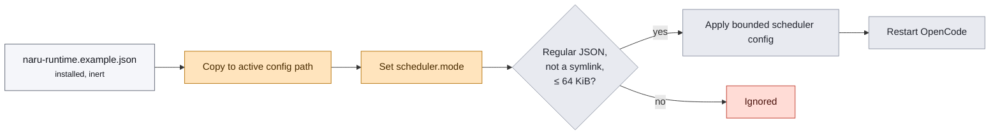

Copy the installed example only when you intentionally want `observe` or `enforce` mode:

```sh
cp .opencode/naru-runtime.example.json .opencode/naru-runtime.json
```



<ul class="naru-legend">
  <li data-kind="write">You edit this</li>
  <li data-kind="danger">Rejected</li>
</ul>

**Walkthrough:** the example is copied during installation but is not active. The runtime file must be regular, non-symlinked JSON no larger than 64 KiB. Use project-local configuration for the current workspace; changing global configuration needs explicit approval.

## Defaults

| Setting | Default | Bound |
| --- | --- | --- |
| `mode` | `off` | `off`, `observe`, `enforce` |
| `maxConcurrentWriters` | 50 ceiling; automatic runs request 10 | 1–50 hard ceiling |
| `maxConcurrentReadOnly` | 50 ceiling; automatic runs request 10 | 0–50 |
| `maxTotalChildren` | 50 ceiling; automatic runs request 10 | 1–50 hard ceiling |
| `maxJudgePasses` | 3 | 1–3 |
| `maxWorkItems` | 256 | 1–256 |
| `maxArtifactBytes` | 65,536 | 1,024–262,144 |
| token lifetimes | 5 minutes | 1 second–24 hours |

## Isolated implementation

| Setting | Default | Bound |
| --- | --- | --- |
| `implementation.workspaceMode` | `auto` | `auto`, `shared`, `worktree` |
| `implementation.maxConcurrentWriters` | 10 | 1–50 |
| `implementation.maxWritersPerWorktree` | 1 | exactly 1 |
| `implementation.cleanWorkspaceRequired` | `true` | exactly `true` |

Scheduler values are hard configuration ceilings. The default ceiling is fifty, but an ordinary run explicitly requests a combined ten-child budget. Only a current explicit user request may raise that run budget, up to fifty. Same-workspace mode permits at most ten writers and requires pairwise-disjoint scheduler claims plus exact Weaver claims before edits. Higher writer counts require isolated mode with one writer per worktree.

`auto` uses one detached Naru-owned worktree per writer only for a clean Git repository. Dirty or unsupported repositories downgrade to the shared ten-writer ceiling without prompting. Only the root orchestrator may invoke worktree mutations. Tool-owned Git operations suppress hooks, mutations are serialized per run, metadata updates are atomic, and changed paths remain contained to Naru-owned roots. The integration worktree is verified before the aggregate is applied back to the unchanged main workspace; failures attempt rollback and local metadata supports recovery after a process restart. This is not a general sandbox and does not protect against unrelated external workspace mutation. Naru never pushes or leaves delivery commits through this mechanism.

`enforce` requires `legacyProtocol2: "reject"`; `observe` may set it to `observe` for explicit Protocol 2 compatibility observation. See [scheduler modes](/naru-opencode/runtime/scheduler-modes/) for behavior and [limitations](/naru-opencode/reference/limitations/) for the enforcement boundary.
