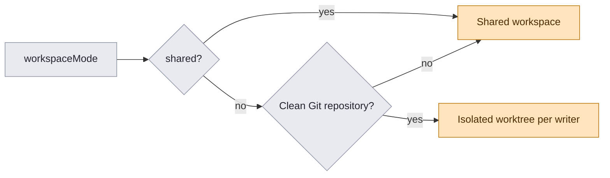

Naru runs on defaults with no configuration file. `naru-runtime.json` is optional and covers two things: how implementation writers use the workspace, and the model classes the `naru-dispatch` tool can select per dispatch. The installer copies `naru-runtime.example.json` into the install root; it never creates or enables `naru-runtime.json`.

```sh
cp .opencode/naru-runtime.example.json .opencode/naru-runtime.json
```

For a global install the same files live in `~/.config/opencode/`. Prefer project-local configuration for the current workspace; changing a global install needs explicit approval.

This is the entire configuration surface:

```json
{
  "schemaVersion": 1,
  "implementation": {
    "cleanWorkspaceRequired": true,
    "maxConcurrentWriters": 50,
    "workspaceMode": "auto"
  },
  "models": {
    "light":    { "use": "wide fan-out, mechanical lookups, simple reads", "chain": ["opencode/glm-5-free", "opencode/minimax-m3-free"] },
    "standard": { "use": "ordinary investigation, edits, checks", "chain": ["openai/gpt-5.6-terra@medium"] },
    "deep":     { "use": "architecture, security, data models, final review, tricky edits", "chain": ["openai/gpt-5.6-sol@high"] }
  }
}
```

## Fields

| Field | Default | Accepted |
| --- | --- | --- |
| `implementation.workspaceMode` | `auto` | `auto`, `shared`, `worktree` |
| `implementation.maxConcurrentWriters` | 50 | integer 1–50 |
| `implementation.cleanWorkspaceRequired` | `true` | `true` only |

`workspaceMode` selects where writers work. `auto` and `worktree` both leave isolated writer worktrees available; `shared` turns them off, and `naru-worktree` then refuses every operation.

`maxConcurrentWriters` is a runaway brake, not a target. The orchestrator decides fan-out from the work in front of it, so a run holding far fewer writers than the ceiling is the normal case. Lower it only to cap the ceiling itself.

`cleanWorkspaceRequired` must be `true`. It documents a requirement rather than exposing a switch: isolated writer mode refuses to start against a dirty workspace.

## The models block

`models` is optional. It defines the model classes the [`naru-dispatch` tool](/naru-opencode/workflows/agents/#models) offers the orchestrator, mapping class names of your choosing to a purpose and an ordered fallback chain:

```json
"models": {
  "<class>": {
    "use": "<when the orchestrator should pick this class>",
    "chain": ["<provider>/<model>@<effort>", "<provider>/<model>", "..."]
  }
}
```

- **Class names are yours.** `light`, `standard`, and `deep` are the examples shipped in `naru-runtime.example.json`, not names the code knows. The `use` string is what the orchestrator reads when choosing a class, so write it as selection guidance.
- **Chain entries are `provider/model` with an optional `@effort` suffix** — for example `openai/gpt-5.6-sol@high`. The suffix sets reasoning effort (`low`, `medium`, `high`, `xhigh`, `max`, and similar) where the model supports it; a per-dispatch `effort` argument overrides it.
- **The chain is ordered fallback.** Entry 0 is tried first. An entry whose provider definitely has no credentials is skipped; an entry that fails at session create or prompt time falls to the next; if every entry fails, the dispatch runs with no model at all and inherits the parent session model. Model resolution never hard-fails a dispatch.
- **Absent means inherit.** With no `models` block the tool still registers, and every dispatch inherits the parent session model — the same behavior as omitting the `class` argument.

The class list is baked into the tool's description when the plugin loads, so the orchestrator always sees the currently configured classes. Restart OpenCode after editing the block.

## Workspace mode resolution


```mermaid
flowchart LR
  A["workspaceMode"]:::gate
  B{"shared?"}:::gate
  C{"Clean Git repository?"}:::gate
  D["Isolated worktree per writer"]:::write
  E["Shared workspace"]:::write

  A --> B
  B -->|yes| E
  B -->|no| C
  C -->|yes| D
  C -->|no| E

  classDef write fill:#ffe4bd,stroke:#b8760f,color:#4a2c00
  classDef gate fill:#e8eaf0,stroke:#8f96a5,color:#22252e
```

<ul class="naru-legend">
  <li data-kind="write">Writers edit here</li>
</ul>

**Walkthrough:** isolation needs a clean repository. If the repository is dirty or worktrees are unavailable, Naru downgrades to the shared workspace silently — it does not prompt, and it does not imitate isolation with directory copies. Only the root orchestrator may invoke `naru-worktree`; writers never commit, merge, or remove worktrees. One writer per logical scope either way, so overlapping scopes serialize.

Isolated worktrees are a containment convenience, not a sandbox. They do not protect against unrelated external mutation of the workspace, and Naru never pushes or leaves delivery commits through this mechanism. See [limitations](/naru-opencode/reference/limitations/) for the full boundary.

## How the file is read

- A missing file means built-in defaults, which match the example exactly.
- It must be a regular file, not a symlink, and no larger than 64 KiB.
- It must be valid JSON with `schemaVersion` set to `1`.
- Unknown fields at either level are rejected rather than ignored.
- An invalid file is an error, not a silent fallback to defaults. `node tools/naru-doctor.js --json` reports it as `invalid-runtime-config` and shows the effective workspace mode.
- The file is read when `naru-worktree` runs, not cached once at startup.
- The `models` block is the one exception to both points: the dispatch plugin reads it once at plugin load, and a missing or malformed file never takes the `naru-dispatch` tool down — dispatches simply inherit the parent session model until the file is fixed and OpenCode restarts.
