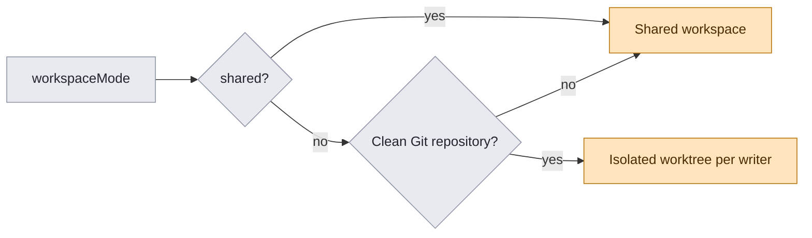

Naru runs on defaults with no configuration file. `naru-runtime.json` is optional and exists only to change how implementation writers use the workspace. The installer copies `naru-runtime.example.json` into the install root; it never creates or enables `naru-runtime.json`.

```sh
cp .opencode/naru-runtime.example.json .opencode/naru-runtime.json
```

For a global install the same files live in `~/.config/opencode/`. Prefer project-local configuration for the current workspace; changing a global install needs explicit approval.

This is the entire configuration surface:

```json
{
  "schemaVersion": 1,
  "implementation": {
    "cleanWorkspaceRequired": true,
    "maxConcurrentWriters": 50,
    "workspaceMode": "auto"
  }
}
```

## Fields

| Field | Default | Accepted |
| --- | --- | --- |
| `implementation.workspaceMode` | `auto` | `auto`, `shared`, `worktree` |
| `implementation.maxConcurrentWriters` | 50 | integer 1–50 |
| `implementation.cleanWorkspaceRequired` | `true` | `true` only |

`workspaceMode` selects where writers work. `auto` and `worktree` both leave isolated writer worktrees available; `shared` turns them off, and `naru-worktree` then refuses every operation.

`maxConcurrentWriters` is a runaway brake, not a target. The orchestrator decides fan-out from the work in front of it, so a run holding far fewer writers than the ceiling is the normal case. Lower it only to cap the ceiling itself.

`cleanWorkspaceRequired` must be `true`. It documents a requirement rather than exposing a switch: isolated writer mode refuses to start against a dirty workspace.

## Workspace mode resolution


```mermaid
flowchart LR
  A["workspaceMode"]:::gate
  B{"shared?"}:::gate
  C{"Clean Git repository?"}:::gate
  D["Isolated worktree per writer"]:::write
  E["Shared workspace"]:::write

  A --> B
  B -->|yes| E
  B -->|no| C
  C -->|yes| D
  C -->|no| E

  classDef write fill:#ffe4bd,stroke:#b8760f,color:#4a2c00
  classDef gate fill:#e8eaf0,stroke:#8f96a5,color:#22252e
```

<ul class="naru-legend">
  <li data-kind="write">Writers edit here</li>
</ul>

**Walkthrough:** isolation needs a clean repository. If the repository is dirty or worktrees are unavailable, Naru downgrades to the shared workspace silently — it does not prompt, and it does not imitate isolation with directory copies. Only the root orchestrator may invoke `naru-worktree`; writers never commit, merge, or remove worktrees. One writer per logical scope either way, so overlapping scopes serialize.

Isolated worktrees are a containment convenience, not a sandbox. They do not protect against unrelated external mutation of the workspace, and Naru never pushes or leaves delivery commits through this mechanism. See [limitations](/naru-opencode/reference/limitations/) for the full boundary.

## How the file is read

- A missing file means built-in defaults, which match the example exactly.
- It must be a regular file, not a symlink, and no larger than 64 KiB.
- It must be valid JSON with `schemaVersion` set to `1`.
- Unknown fields at either level are rejected rather than ignored.
- An invalid file is an error, not a silent fallback to defaults. `node tools/naru-doctor.js --json` reports it as `invalid-runtime-config` and shows the effective workspace mode.
- The file is read when `naru-worktree` runs, not cached once at startup.
