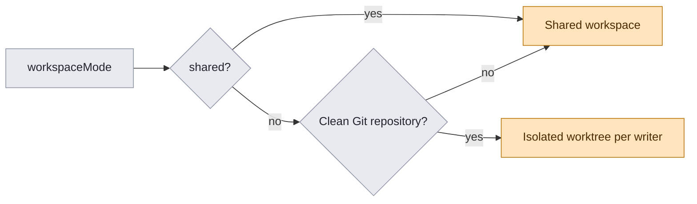

Naru runs on defaults with no configuration file. `naru-runtime.json` is optional and covers writer workspace behavior, configured MCP tool policy, review defaults, and the model classes the `naru-dispatch` plugin turns into per-class agent variants. The installer copies `naru-runtime.example.json` into the install root; it never creates or enables `naru-runtime.json`.

```sh
cp .opencode/naru-runtime.example.json .opencode/naru-runtime.json
```

For a global install the same files live in `~/.config/opencode/`. Prefer project-local configuration for the current workspace; changing a global install needs explicit approval.

This is the entire configuration surface:

```json
{
  "schemaVersion": 1,
  "implementation": {
    "cleanWorkspaceRequired": true,
    "maxConcurrentWriters": 50,
    "workspaceMode": "auto"
  },
  "mcp": {
    "configuredTools": "allow"
  },
  "models": {
    "light":    { "use": "wide fan-out, mechanical lookups, simple reads", "chain": ["opencode/glm-5-free", "opencode/minimax-m3-free"] },
    "standard": { "use": "ordinary investigation, edits, checks", "chain": ["openai/gpt-5.6-terra@medium"] },
    "deep":     { "use": "architecture, security, data models, final review, tricky edits", "chain": ["openai/gpt-5.6-sol@high"] }
  },
  "review": {
    "defaultDecision": "automatic",
    "defaultOutput": "concise",
    "defaultProfile": "release-critical"
  }
}
```

## Fields

| Field | Default | Accepted |
| --- | --- | --- |
| `implementation.workspaceMode` | `auto` | `auto`, `shared`, `worktree` |
| `implementation.maxConcurrentWriters` | 50 | integer 1–50 |
| `implementation.cleanWorkspaceRequired` | `true` | `true` only |
| `mcp.configuredTools` | `off` | `off`, `ask`, `allow` |

`workspaceMode` selects where writers work. `auto` and `worktree` both leave isolated writer worktrees available; `shared` turns them off, and `naru-worktree` then refuses every operation.

`maxConcurrentWriters` is a runaway brake, not a target. The orchestrator decides fan-out from the work in front of it, so a run holding far fewer writers than the ceiling is the normal case. Lower it only to cap the ceiling itself.

`cleanWorkspaceRequired` must be `true`. It documents a requirement rather than exposing a switch: isolated writer mode refuses to start against a dirty workspace.

## Configured MCP tools

`mcp.configuredTools` controls tools belonging to enabled servers in OpenCode's effective `mcp` configuration:

- **`off`** adds no permission rules. Static agent permissions and other OpenCode policy are inherited unchanged. This is the backward-safe default.
- **`ask`** adds a server-scoped `ask` rule for every eligible configured MCP namespace.
- **`allow`** adds server-scoped `allow` rules to the orchestrator, all three base subagents, and every generated model variant. It also replaces MCP-specific `ask` rules with `allow` while active, so inherited or exact MCP asks do not prompt. Explicit MCP `deny` rules remain effective.

The plugin reads only server IDs and `enabled` flags. It never copies commands, URLs, environment values, headers, or credentials into agent policy. Server IDs that contain glob syntax, normalize to a colliding namespace, overlap another configured server namespace, or could cover a native tool are skipped rather than granted. OpenCode's global `'*': deny` remains first, and generated rules are limited to normalized `<server>_*` namespaces; Naru never emits a global allow.

Generated rules and ask overrides carry ownership metadata on each Naru agent. Repeated config hooks replace them idempotently, disabled or removed servers are cleaned up, and switching to `off` restores the prior asks. If a user changes a generated value, cleanup preserves that edit.

This setting is a trust decision, not task authorization. MCP servers can expose tools that mutate local or remote data, and the reader/runner native read-only boundary does not mechanically constrain those tools. Every role must still obey the current request, scope, secret, delivery, database, and irreversible-action rules; it should not ask merely because an authorized operation uses a configured MCP tool.

To enable the requested no-prompt behavior without replacing existing settings, merge this block into the active `naru-runtime.json`, preserve its `models`, `review`, and `implementation` blocks, then restart OpenCode:

```json
"mcp": {
  "configuredTools": "allow"
}
```

Do not copy the complete example over an existing runtime file blindly. For a project install, edit `.opencode/naru-runtime.json`; for a global install, edit `~/.config/opencode/naru-runtime.json` only when that global security-posture change is intended.

## The models block

`models` is optional. It defines the model classes the [`naru-dispatch` plugin](/naru-opencode/workflows/agents/#models) turns into per-class agent variants at startup, mapping class names of your choosing to a purpose and an ordered chain:

```json
"models": {
  "<class>": {
    "use": "<when the orchestrator should pick this class>",
    "chain": ["<provider>/<model>@<effort>", "<provider>/<model>", "..."]
  }
}
```

- **Class names are yours.** `light`, `standard`, and `deep` are the examples shipped in `naru-runtime.example.json`, not names the code knows. The `use` string is what the orchestrator reads when choosing a class — it lands in a generated "Model classes" appendix in the orchestrator's prompt — so write it as selection guidance.
- **Each class becomes a set of agent variants.** At plugin load, the three base subagents are cloned into hidden per-class variants — `naru-reader-<class>`, `naru-runner-<class>`, `naru-writer-<class>` — with the class's model and reasoning effort baked in. The orchestrator dispatches a variant by name through OpenCode's native `task` tool. Variants are byte-for-byte permission clones of the base agents; model selection never touches permissions.
- **Chain entries are `provider/model` with an optional `@effort` suffix** — for example `openai/gpt-5.6-sol@high`. The suffix sets reasoning effort (`low`, `medium`, `high`, `xhigh`, `max`, and similar) where the model supports it, via OpenCode's `variant` field. There is no per-dispatch effort override; finer granularity means defining more classes (for example `"deep-max": { "chain": ["openai/gpt-5.6-sol@max"] }`).
- **The chain resolves once, at config load.** The first entry whose provider is authenticated (per OpenCode's auth state) is baked into the class's variants. If the auth state is unknown, the first entry is used. If no entry is authenticated, the class is skipped and generates no variants — nothing breaks. There is no runtime fallthrough; a model that fails at runtime surfaces as a failed child dispatch.
- **Absent means no variants.** With no `models` block the orchestrator uses the plain base agents, which inherit the parent session model.

The variants, the orchestrator's `task` allowlist, and the "Model classes" prompt appendix are regenerated idempotently on every config load. The block is read when the plugin loads, so restart OpenCode after editing it.

## Workspace mode resolution


```mermaid
flowchart LR
  A["workspaceMode"]:::gate
  B{"shared?"}:::gate
  C{"Clean Git repository?"}:::gate
  D["Isolated worktree per writer"]:::write
  E["Shared workspace"]:::write

  A --> B
  B -->|yes| E
  B -->|no| C
  C -->|yes| D
  C -->|no| E

  classDef write fill:#ffe4bd,stroke:#b8760f,color:#4a2c00
  classDef gate fill:#e8eaf0,stroke:#8f96a5,color:#22252e
```

<ul class="naru-legend">
  <li data-kind="write">Writers edit here</li>
</ul>

**Walkthrough:** isolation needs a clean repository. If the repository is dirty or worktrees are unavailable, Naru downgrades to the shared workspace silently — it does not prompt, and it does not imitate isolation with directory copies. Only the root orchestrator may invoke `naru-worktree`; writers never commit, merge, or remove worktrees. One writer per logical scope either way, so overlapping scopes serialize.

Isolated worktrees are a containment convenience, not a sandbox. They do not protect against unrelated external mutation of the workspace, and Naru never pushes or leaves delivery commits through this mechanism. See [limitations](/naru-opencode/reference/limitations/) for the full boundary.

## How the file is read

- A missing file means the built-in defaults listed above. The shipped example deliberately opts into `mcp.configuredTools: "allow"` and preferred review defaults.
- It must be a regular file, not a symlink, and no larger than 64 KiB.
- It must be valid JSON with `schemaVersion` set to `1`.
- Unknown fields at either level are rejected rather than ignored.
- An invalid file is an error, not a silent fallback to defaults. From a source checkout, `npm run doctor -- --json` reports it as `invalid-runtime-config` and shows the effective workspace mode; installed `naru-doctor.js` retains that runtime filename.
- The file is read when `naru-worktree` runs, not cached once at startup.
- The `models` and `mcp` blocks are applied by the `naru-dispatch` plugin at startup. A malformed runtime file never synthesizes MCP permissions; fix it and restart OpenCode.
