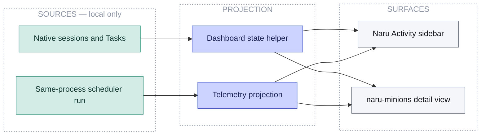

Install the optional dashboard with `./install.sh --with-dashboard`, then restart OpenCode. It adds a **Naru Activity** sidebar section and `/naru-minions` detail view in the full terminal TUI.

<ul class="naru-legend">
  <li data-kind="read">Read-only</li>
</ul>

**Walkthrough:** the dashboard recognizes canonical Naru children and managed routes, then shows status, age, task, route, and model metadata. When a scheduler run exists in the same process, telemetry adds mode, item counts, local budget pressure, quality-gate progress, oldest blocked item, and bounded actor groups.

Telemetry is hidden when unavailable. It is process-local, non-durable, not cross-process, not an authoritative background-completion signal, and not a provider or global concurrency cap. The dashboard is unavailable under `opencode --mini`.

For installation and troubleshooting details, see the canonical [user guide](/naru-opencode/user-guide/).
