The scheduler is installed but **off by default**. Configure it only by intentionally creating `naru-runtime.json` beside the installed plugins.

```mermaid
stateDiagram-v2
  [*] --> Off
  Off: Protocol 2 prompt workflow
  Off --> Observe: mode = observe
  Observe: Protocol 3; record incidents; fail open
  Observe --> Enforce: mode = enforce
  Enforce: Protocol 3; refuse failed admission
  Enforce --> Observe: mode = observe
  Observe --> Off: mode = off
  Enforce --> Off: mode = off
```

**Walkthrough:** `off` uses complete prompt-level Protocol 2 and retains no scheduler run or journal. `observe` uses Protocol 3 state and records typed admission incidents, but continues the otherwise authorized Task when runtime admission validation fails. `enforce` refuses incompatible capability, invalid or replayed tokens, stale revisions, conflicts, expiry, and exhausted budgets; it requires `legacyProtocol2: "reject"` and rejects Protocol 2.

Scheduler mode selection does not grant permissions, alter model routing, or change review and delivery boundaries. Runtime budget fields are hard ceilings and default to fifty, while automatic runs request a combined ten-child pool. A current explicit user request may raise the run budget up to fifty. Shared mode permits at most ten writers with pairwise-disjoint scheduler claims and exact Weaver ownership before edits; writer counts above ten require isolated mode. Isolated writer behavior is separately controlled by `implementation.workspaceMode` and the root-orchestrator-only worktree tool, whose hook-suppressed Git mutations are serialized per run, metadata-atomic, path-contained, recoverable, and rollback-attempting. It is not a general sandbox and does not protect against unrelated external workspace mutation. See [runtime configuration](https://sean35mm.github.io/naru-opencode/reference/runtime-config/) and the canonical [user guide](https://sean35mm.github.io/naru-opencode/user-guide/).
