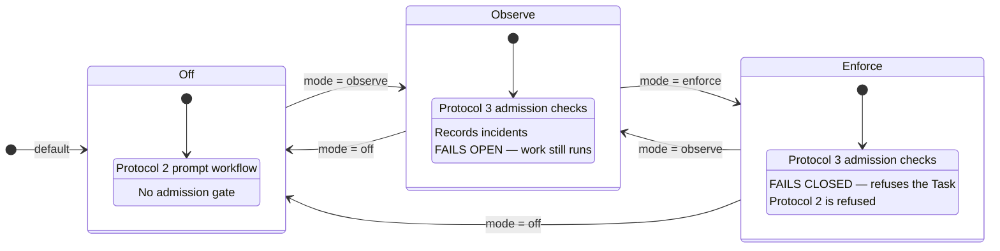

The scheduler is installed but **off by default**. Configure it only by intentionally creating `naru-runtime.json` beside the installed plugins.

```mermaid
stateDiagram-v2
  direction LR
  [*] --> Off: default

  state Off {
    [*] --> off_note
    off_note: Protocol 2 prompt workflow
    off_note: No admission gate
  }

  state Observe {
    [*] --> obs_note
    obs_note: Protocol 3 admission checks
    obs_note: Records incidents
    obs_note: FAILS OPEN — work still runs
  }

  state Enforce {
    [*] --> enf_note
    enf_note: Protocol 3 admission checks
    enf_note: FAILS CLOSED — refuses the Task
    enf_note: Protocol 2 is refused
  }

  Off --> Observe: mode = observe
  Observe --> Enforce: mode = enforce
  Enforce --> Observe: mode = observe
  Observe --> Off: mode = off
  Enforce --> Off: mode = off
```

The only difference between `observe` and `enforce` is what happens when an admission check fails: `observe` records the incident and lets the work proceed, `enforce` refuses it.

**Walkthrough:** `off` uses complete prompt-level Protocol 2 and retains no scheduler run or journal. `observe` uses Protocol 3 state and records typed admission incidents, but continues the otherwise authorized Task when runtime admission validation fails. `enforce` refuses incompatible capability, invalid or replayed tokens, stale revisions, conflicts, expiry, and exhausted budgets; it requires `legacyProtocol2: "reject"` and rejects Protocol 2.

Scheduler mode selection does not grant permissions, alter model routing, or change review and delivery boundaries. Runtime budget fields are hard ceilings of 50, and default `turbo` or omitted/generic budgets may use up to 50 combined active children when ready work has concrete expected value; empty capacity is correct and no speed guarantee is made. Explicit `auto` or lower ceilings remain compatibility and rollback controls. Shared mode permits at most ten writers while useful read-only work may use remaining turbo capacity, with pairwise-disjoint scheduler claims and exact Weaver ownership before edits. Clean isolated mode permits up to 50 disjoint writers, one per worktree; dirty or unsupported isolation downgrades writers to shared ten without prompting. Isolated writer behavior is separately controlled by `implementation.workspaceMode` and the root-orchestrator-only worktree tool, whose hook-suppressed Git mutations are serialized per run, metadata-atomic, path-contained, recoverable, and rollback-attempting. It is not a general sandbox and does not protect against unrelated external workspace mutation. See [runtime configuration](/naru-opencode/reference/runtime-config/) and the canonical [user guide](/naru-opencode/user-guide/).
