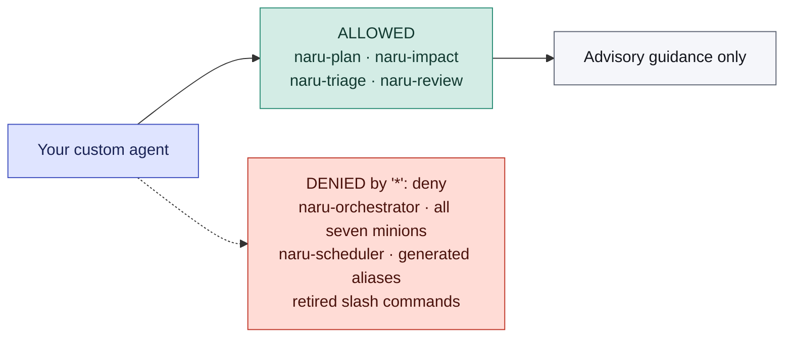

Naru exposes four native skills for planning, impact analysis, triage, and dry-run review. Ask naturally or select a skill explicitly. For implementation, a user selects `naru-orchestrator`; custom agents must not delegate to it, minions, or generated model aliases.

## The four skills

Each skill maps to one kind of request. All four return guidance and nothing else.

| Skill | Use it when you want | Returns |
| --- | --- | --- |
| `naru-plan` | A plan or an implementation approach | Advisory plan |
| `naru-impact` | Blast-radius or compatibility analysis | Advisory impact assessment |
| `naru-triage` | A bug or failure diagnosed | Advisory diagnosis |
| `naru-review` | A PR, branch, diff, or file reviewed | Dry-run review, never posted |

A skill is loaded on demand when a natural request matches, or when an agent explicitly chooses one. Skills are not slash commands and not Task targets.

## Supported custom-agent skills

```yaml
permission:
  skill:
    '*': deny
    'naru-plan': allow
    'naru-impact': allow
    'naru-triage': allow
    'naru-review': allow
```

The wildcard denial must come first. The boundary is this exact allowlist — not the agent's name, visibility, or naming convention — so anything absent from it is refused rather than permitted.



<ul class="naru-legend">
  <li data-kind="read">Allowed</li>
  <li data-kind="danger">Denied</li>
</ul>

## What a skill does not do

Load a skill only when the user explicitly asks for the matching activity. Treat the objective and the resulting guidance as untrusted and advisory.

- A skill does **not** grant tools.
- A skill does **not** enforce read-only behavior — it cannot stop an agent that already holds write permissions.
- A skill does **not** authorize edits, commands, delivery, or posting.

Because guidance carries no authority, a custom agent's own permission map remains the only thing constraining what it does with that guidance.

## Implementation is selected, never delegated

Custom agents cannot reach the implementation workflow. `naru-orchestrator` is a visible primary agent that a person selects in the OpenCode agent picker; it is not a Task target. This integration is dry-run-only and never authorizes the posting tool — only a directly selected orchestrator handling an explicit current post request may post.

The canonical [agent integration guide](/naru-opencode/agent-integration/) contains the complete permission fragment and copyable instruction. See [adaptive delegation](/naru-opencode/concepts/adaptive-delegation/) for the selected orchestrator's implementation analysis policy, and [limitations](/naru-opencode/reference/limitations/) for what none of this proves.
