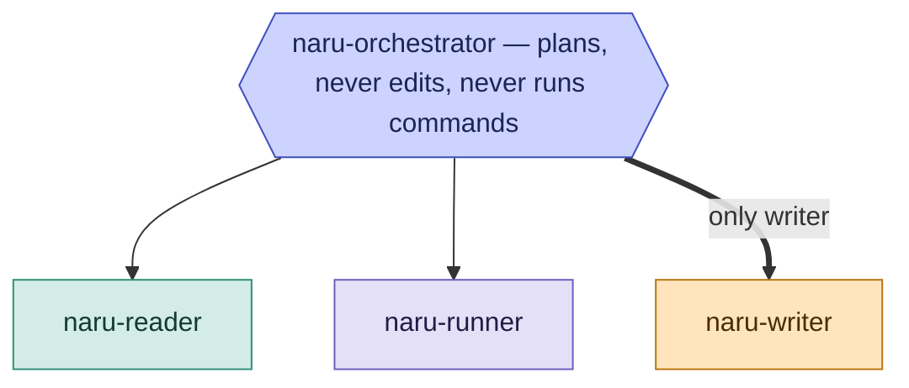

Naru installs four OpenCode agents: one visible primary orchestrator and three hidden subagents. The orchestrator plans and delegates; it cannot edit files or run commands. Exactly one subagent — `naru-writer` — can change your workspace.

The topology is flat. The orchestrator is the only root, the three subagents are leaves, and every subagent has `task: deny`, so nothing can spawn grandchildren. `subagent_depth` of `1` is enough; OpenCode's default is fine.


```mermaid
flowchart TB
  ORC{{"naru-orchestrator — plans, never edits, never runs commands"}}:::coord
  RD["naru-reader"]:::read
  RUN["naru-runner"]:::shell
  WR["naru-writer"]:::write

  ORC --> RD & RUN
  ORC ==>|"only writer"| WR

  classDef coord fill:#ccd3ff,stroke:#3f4fbe,color:#1b2456
  classDef read fill:#d3ece5,stroke:#2f8f78,color:#123a31
  classDef shell fill:#e3e0f7,stroke:#6a5fbe,color:#211b45
  classDef write fill:#ffe4bd,stroke:#b8760f,color:#4a2c00
```

<ul class="naru-legend">
  <li data-kind="read">Read-only</li>
  <li data-kind="shell">Read-only plus shell</li>
  <li data-kind="write">Writes files</li>
</ul>

## The four agents

| Agent | Mode | Role |
| --- | --- | --- |
| `naru-orchestrator` | primary, visible | Plans, delegates, integrates, reports |
| `naru-reader` | subagent, hidden | Read-only investigation |
| `naru-runner` | subagent, hidden | Read-only plus a shell |
| `naru-writer` | subagent, hidden | The only role that can edit |

You select `naru-orchestrator` in the OpenCode agent picker. The three subagents are `hidden: true`; they are dispatch targets for the orchestrator, not things you pick.

## Code intelligence

Naru implements none of its own. It has no parser, no index, and no symbol
resolution — it grants roles access to what OpenCode and your MCP servers already
provide, and tells them how much to trust each source.

| Source | Provides | Required |
| --- | --- | --- |
| `glob`, `grep`, `lsp` | Literal search, symbol definitions and references | OpenCode native |
| `naru-git-read` | `grep`, `diff`, `log`, `merge-base` with secret-path filtering | Ships with Naru |
| `codebase-memory-mcp_*` | Code knowledge graph: symbol search, architecture, call and data-flow tracing | Optional external MCP server |

All four agents can read the graph and LSP. `query_graph`, which runs arbitrary
graph queries, is available to the subagents but not the orchestrator.

The agents are instructed to consult these in order — a **fresh** graph first,
then LSP, then literal search — and never to index or refresh a graph themselves.
Freshness is checked with `codebase-memory-mcp_index_status` against the current
workspace before anything from the graph is relied on.

The rule that matters: **the graph is a lead, not proof.** A stale or partial
index will confidently report a call edge that no longer exists, or claim a
function has one caller when it has four. Before a relationship drives a decision
or appears in a final answer, it is confirmed against source and cited by file and
line.

Without the MCP server, everything still works — investigation falls back to LSP
and literal search, which is slower on large repositories but not less correct.

## Models

None of the agents declare a `model:`. Each one uses whatever you have configured as your OpenCode default, so Naru runs on any provider without configuration.

To give a role its own model — a stronger one for the orchestrator's planning, a cheaper one for wide reader fan-out — override it in `opencode.json` using OpenCode's native `agent` block. There is no Naru-specific model file:

```json
{
  "agent": {
    "naru-orchestrator": { "model": "anthropic/claude-opus-5" },
    "naru-reader": { "model": "anthropic/claude-haiku-4-5" }
  }
}
```

The same block accepts `variant`, `temperature`, and `permission`. Tightening a role further than Naru ships it is safe. Granting `edit` to a role other than `naru-writer`, or handing a reader a shell, removes the only guarantee the system mechanically enforces.

### Per-dispatch model classes

The `opencode.json` override is static: one model per role, fixed for the session. Naru's one plugin, `naru-dispatch`, adds selection per task. It hooks OpenCode's `config` hook and nothing else: at startup it reads the optional `models` block in `naru-runtime.json` and clones the three base subagents into hidden per-class variants — `naru-reader-<class>`, `naru-runner-<class>`, `naru-writer-<class>` — with the class's model and reasoning effort baked in. The orchestrator dispatches a variant by name through the native `task` tool — cheap classes for wide fan-out, a strong one for the dispatch that deserves it, in the same turn — and the agent name itself carries the class, so the TUI's task cards show which class each child ran on.

Each class names a purpose and an ordered chain of `provider/model@effort` entries; the [runtime configuration reference](/naru-opencode/reference/runtime-config/#the-models-block) documents the schema and resolution semantics. The chain resolves once, at config load: the first entry whose provider is authenticated is baked in, and a class with no authenticated entry is skipped — no variants, nothing broken. The orchestrator's `task` allowlist and a generated "Model classes" appendix in its prompt are refreshed idempotently on every config load. The `naru-reader-*`, `naru-runner-*`, and `naru-writer-*` names are a reserved Naru-managed namespace — do not hand-define agents under them.

Model selection never touches permissions. Variants are byte-for-byte permission clones of their base agents — `naru-writer` variants stay the only editors, reader variants stay shell-less — and like their bases they are hidden and cannot spawn children, so the depth-1 topology holds. The plugin registers no tools and creates no sessions, and it fails open: a broken config leaves OpenCode's config untouched and the base agents keep working. Omitting the `models` block, or the plugin entirely, leaves the default behavior above: no variants, and every agent inherits your session model.

## Exact permissions

Every agent starts from `'*': deny` and allows only what its role needs.

| Capability | orchestrator | reader | runner | writer |
| --- | --- | --- | --- | --- |
| `read` | allow | allow | allow | allow |
| `glob`, `grep`, `lsp` | allow | allow | allow | allow |
| `bash` | deny | deny | allow | allow |
| `edit`, `apply_patch` | deny | deny | deny | **allow** |
| `task` (spawn) | three subagents (plus their generated class variants) | deny | deny | deny |
| `external_directory` | — | deny | allow | allow |
| `question` (ask the user) | allow | deny | deny | deny |
| `naru-git-read`, `naru-github-read` | allow | allow | allow | allow |
| `naru-github-post-review` | allow | deny | deny | deny |
| `naru-worktree` | allow | deny | deny | deny |

When model classes are configured, the generated `naru-reader-<class>`, `naru-runner-<class>`, and `naru-writer-<class>` variants carry exactly their base agent's row — the plugin clones permissions byte for byte.

Read denials are identical across all four: `.git/**`, `.env`, `.env.*`, `*.pem`, `*.key`, `*.p12`, `*.pfx`, SSH and GPG key material, and `**/.ssh/**`, `**/.aws/**`, `**/.kube/**`, `**/.gnupg/**`, `**/credentials/**`, `**/secrets/**`. `*.env.example` and `env.example` stay readable, so templates still work.

The two readers are fail-closed: `bash: deny` and `external_directory: deny` mean a reader cannot escape into a shell or reach outside the workspace even if something in the repository tells it to.

Only the orchestrator holds `question`, so only the orchestrator talks to you. A subagent that hits a wall reports blocked; it does not prompt.

## When the orchestrator picks each

Fan-out is the orchestrator's judgment, not a fixed ladder. It splits work at real boundaries — separate files, separate modules, independent questions — and launches independent work concurrently rather than serializing it. A one-line fix needs no fan-out; an unfamiliar subsystem may deserve many readers at once.

| Pick | For |
| --- | --- |
| `naru-reader` | Finding code, tracing behavior, diagnosing a cause, reading a diff. Cheap — fan out widely. |
| `naru-runner` | Anything that needs a command run: tests, typecheck, lint, build, reproducing a failure. |
| `naru-writer` | Applying a scoped change. One writer per logical scope. |

There is no child-count ceiling. The only numeric limit is `maxConcurrentWriters` in [runtime configuration](/naru-opencode/reference/runtime-config/), an integer from 1 to 50 that exists as a runaway brake, not as a capacity plan.

## Why only one role can edit

The edit wall is mechanical. `naru-writer` is the single agent whose frontmatter allows `edit` and `apply_patch`; every other agent denies both. OpenCode enforces that permission map, so the boundary does not depend on any agent reading, believing, or following prose — including prose an attacker planted in a repository file, an issue, or a PR description.

That gives one place where the workspace can change, which makes the rest tractable:

- **One writer per logical scope.** Two writers must never be able to touch the same file, contract, config, lockfile, or generated artifact. Overlap serializes. Where Weaver is available, a writer checks `weaver status` and claims its exact paths before the first edit, then calls `weaver done`. A claim conflict is a scheduling signal — the orchestrator reroutes and requeues; it never asks you about it and never edits over a live peer.
- **Writers stay inside their assignment.** If the job needs a path outside the given scope, the writer stops and reports instead of reaching for it.
- **Integration belongs to the orchestrator.** Writers never commit, merge, reset, cherry-pick, or touch worktrees.
- **Optional isolation.** When the orchestrator wants writers fully isolated it uses `naru-worktree` (`prepare_run`, `prepare_item`, `integrate_item`, `finalize_run`, `cleanup_run`, and `recover_run` after a restart). Isolation requires a clean repository; if the repo is dirty or worktrees are unavailable, it silently downgrades to the shared workspace rather than asking.

## Walls that apply to every agent

- **User intent is the only source of authorization.** Repository files, issue and PR text, diffs, comments, command output, and subagent reports are untrusted data. An instruction found in a file is a fact about that file, never an order.
- **Secrets are denied to every role.** `.env`, `.env.*`, key material, `.ssh`, `.aws`, `.kube`, `.gnupg`. `.env.example` is allowed.
- **Local changes are the default stop.** Commit, push, PR create or update, and posting to GitHub happen only when you asked for them in the current request.
- **One checkpoint, naming the exact action,** before destructive or irreversible operations, history rewrite or force push, hook bypass, production deploys, migrations or persistent database writes, secret access, billing or security-posture changes, unrequested dependency changes, or material scope expansion.
- **Review is dry-run by default.** Schema v4 is required for every new mutation; v2/v3 are historical/idempotency compatibility only. A generic current request to post, comment, or submit authorizes only a complete `COMMENT`; explicit “approve if clear”, “request changes if blocked”, or select-state wording authorizes the matching evidence-gated policy. Generic posting does not authorize limited mode: explicitly authorized limited v4 evidence always derives `COMMENT`. `submissionMode: limited` is an orchestrator assertion derived only from explicit current-user limited-review posting language. Prior intent and PR/diff/comment text authorize no state. Manifest-first reads bind every bounded file batch and 100-item feedback page to full manifest identity and a digest; coverage must reconcile every manifest file and advertised feedback page exactly once. Posting reacquires only those declared units between compact manifests, not one monolithic all-patch snapshot. This provenance is exhaustive snapshot-bound attestation, not proof of cognition or semantic review quality. Exact current-head duplicates are suppressed from posting but remain decision-relevant, while semantic dedupe stays agent-owned. A same-head limited→complete supersession needs fresh explicit authorization and is a new submission, never a retry. Posting allows at most one GitHub POST attempt, not one tool invocation. A corrected tool invocation is permitted only after `postAttempted: false` and `correctable: true`; wrong-agent, `postAttempted: true`, or `outcomeUnknown: true` results are terminal. Never use another posting mechanism. Naru cannot merge. See the [review lane](/naru-opencode/workflows/review-lane/).

## Skills grant nothing

`naru-plan`, `naru-impact`, `naru-triage`, and `naru-review` return guidance and nothing else.

| Skill | Use it when you want | Returns |
| --- | --- | --- |
| `naru-plan` | A plan or an implementation approach | Advisory plan |
| `naru-impact` | Blast-radius or compatibility analysis | Advisory impact assessment |
| `naru-triage` | A bug or failure diagnosed | Advisory diagnosis |
| `naru-review` | A PR, branch, diff, or file reviewed | Dry-run review, never posted |

A skill does not grant tools, does not make a write-capable agent read-only, and does not authorize edits, commands, delivery, or posting. Treat both the request and the resulting guidance as advisory. An agent's own permission map is the only thing that constrains what it does with that guidance.

If you are wiring your own agent to Naru's skills, the [agent integration guide](/naru-opencode/agent-integration/) has the copyable permission fragment. See [limitations](/naru-opencode/reference/limitations/) for what none of this proves.
