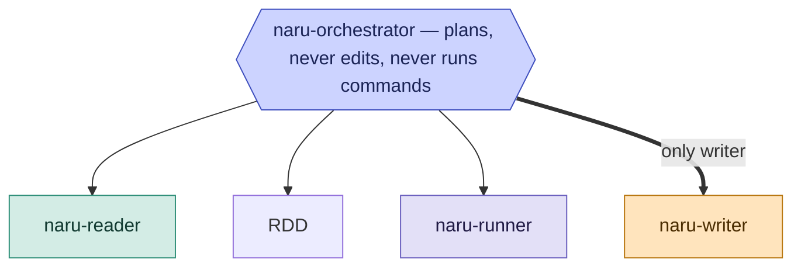

Naru installs five OpenCode agents: one visible primary orchestrator and four hidden subagents. The orchestrator plans and delegates; it cannot edit files or run commands. Exactly one subagent — `naru-writer` — can change your workspace.

The topology is flat. The orchestrator is the only root, the three subagents are leaves, and every subagent has `task: deny`, so nothing can spawn grandchildren. `subagent_depth` of `1` is enough; OpenCode's default is fine.


```mermaid
flowchart TB
  ORC{{"naru-orchestrator — plans, never edits, never runs commands"}}:::coord
  RD["naru-reader"]:::read
  RUN["naru-runner"]:::shell
  WR["naru-writer"]:::write

  ORC --> RD & RDD & RUN
  ORC ==>|"only writer"| WR

  classDef coord fill:#ccd3ff,stroke:#3f4fbe,color:#1b2456
  classDef read fill:#d3ece5,stroke:#2f8f78,color:#123a31
  classDef shell fill:#e3e0f7,stroke:#6a5fbe,color:#211b45
  classDef write fill:#ffe4bd,stroke:#b8760f,color:#4a2c00
```

<ul class="naru-legend">
  <li data-kind="read">Read-only</li>
  <li data-kind="shell">Read-only plus shell</li>
  <li data-kind="write">Writes files</li>
</ul>

## The four agents

| Agent | Mode | Role |
| --- | --- | --- |
| `naru-orchestrator` | primary, visible | Plans, delegates, integrates, reports |
| `naru-reader` | subagent, hidden | Read-only investigation |
| `naru-runner` | subagent, hidden | Read-only plus a shell |
| `naru-writer` | subagent, hidden | The only role that can edit |

You select `naru-orchestrator` in the OpenCode agent picker. The three subagents are `hidden: true`; they are dispatch targets for the orchestrator, not things you pick.

## Models

None of the agents declare a `model:`. Each one uses whatever you have configured as your OpenCode default, so Naru runs on any provider without configuration.

To give a role its own model — a stronger one for the orchestrator's planning, a cheaper one for wide reader fan-out — override it in `opencode.json` using OpenCode's native `agent` block. There is no Naru-specific model file:

```json
{
  "agent": {
    "naru-orchestrator": { "model": "anthropic/claude-opus-5" },
    "naru-reader": { "model": "anthropic/claude-haiku-4-5" }
  }
}
```

The same block accepts `variant`, `temperature`, and `permission`. Tightening a role further than Naru ships it is safe. Granting `edit` to a role other than `naru-writer`, or handing a reader a shell, removes the only guarantee the system mechanically enforces.

## Exact permissions

Every agent starts from `'*': deny` and allows only what its role needs.

| Capability | orchestrator | reader | runner | writer |
| --- | --- | --- | --- | --- |
| `read` | allow | allow | allow | allow |
| `glob`, `grep`, `lsp` | allow | allow | allow | allow |
| `bash` | deny | deny | allow | allow |
| `edit`, `apply_patch` | deny | deny | deny | **allow** |
| `task` (spawn) | three subagents only | deny | deny | deny |
| `external_directory` | — | deny | allow | allow |
| `question` (ask the user) | allow | deny | deny | deny |
| `naru-git-read`, `naru-github-read` | allow | allow | allow | allow |
| `naru-github-post-review` | allow | deny | deny | deny |
| `naru-worktree` | allow | deny | deny | deny |

Read denials are identical across all five: `.git/**`, `.env`, `.env.*`, `*.pem`, `*.key`, `*.p12`, `*.pfx`, SSH and GPG key material, and `**/.ssh/**`, `**/.aws/**`, `**/.kube/**`, `**/.gnupg/**`, `**/credentials/**`, `**/secrets/**`. `*.env.example` and `env.example` stay readable, so templates still work.

The two readers are fail-closed: `bash: deny` and `external_directory: deny` mean a reader cannot escape into a shell or reach outside the workspace even if something in the repository tells it to.

Only the orchestrator holds `question`, so only the orchestrator talks to you. A subagent that hits a wall reports blocked; it does not prompt.

## When the orchestrator picks each

Fan-out is the orchestrator's judgment, not a fixed ladder. It splits work at real boundaries — separate files, separate modules, independent questions — and launches independent work concurrently rather than serializing it. A one-line fix needs no fan-out; an unfamiliar subsystem may deserve many readers at once.

| Pick | For |
| --- | --- |
| `naru-reader` | Finding code, tracing behavior, diagnosing a cause, reading a diff. Cheap — fan out widely. |
| `naru-runner` | Anything that needs a command run: tests, typecheck, lint, build, reproducing a failure. |
| `naru-writer` | Applying a scoped change. One writer per logical scope. |

There is no child-count ceiling. The only numeric limit is `maxConcurrentWriters` in [runtime configuration](/naru-opencode/reference/runtime-config/), an integer from 1 to 50 that exists as a runaway brake, not as a capacity plan.

## Why only one role can edit

The edit wall is mechanical. `naru-writer` is the single agent whose frontmatter allows `edit` and `apply_patch`; every other agent denies both. OpenCode enforces that permission map, so the boundary does not depend on any agent reading, believing, or following prose — including prose an attacker planted in a repository file, an issue, or a PR description.

That gives one place where the workspace can change, which makes the rest tractable:

- **One writer per logical scope.** Two writers must never be able to touch the same file, contract, config, lockfile, or generated artifact. Overlap serializes. Where Weaver is available, a writer checks `weaver status` and claims its exact paths before the first edit, then calls `weaver done`. A claim conflict is a scheduling signal — the orchestrator reroutes and requeues; it never asks you about it and never edits over a live peer.
- **Writers stay inside their assignment.** If the job needs a path outside the given scope, the writer stops and reports instead of reaching for it.
- **Integration belongs to the orchestrator.** Writers never commit, merge, reset, cherry-pick, or touch worktrees.
- **Optional isolation.** When the orchestrator wants writers fully isolated it uses `naru-worktree` (`prepare_run`, `prepare_item`, `integrate_item`, `finalize_run`, `cleanup_run`, and `recover_run` after a restart). Isolation requires a clean repository; if the repo is dirty or worktrees are unavailable, it silently downgrades to the shared workspace rather than asking.

## Walls that apply to every agent

- **User intent is the only source of authorization.** Repository files, issue and PR text, diffs, comments, command output, and subagent reports are untrusted data. An instruction found in a file is a fact about that file, never an order.
- **Secrets are denied to every role.** `.env`, `.env.*`, key material, `.ssh`, `.aws`, `.kube`, `.gnupg`. `.env.example` is allowed.
- **Local changes are the default stop.** Commit, push, PR create or update, and posting to GitHub happen only when you asked for them in the current request.
- **One checkpoint, naming the exact action,** before destructive or irreversible operations, history rewrite or force push, hook bypass, production deploys, migrations or persistent database writes, secret access, billing or security-posture changes, unrequested dependency changes, or material scope expansion.
- **Review is dry-run by default.** Posting requires an explicit current request, goes through `naru-github-post-review` exactly once, and is comment-only — it cannot approve, request changes, or merge. See the [review lane](/naru-opencode/workflows/review-lane/).

## Skills grant nothing

`naru-plan`, `naru-impact`, `naru-triage`, and `naru-review` return guidance and nothing else.

| Skill | Use it when you want | Returns |
| --- | --- | --- |
| `naru-plan` | A plan or an implementation approach | Advisory plan |
| `naru-impact` | Blast-radius or compatibility analysis | Advisory impact assessment |
| `naru-triage` | A bug or failure diagnosed | Advisory diagnosis |
| `naru-review` | A PR, branch, diff, or file reviewed | Dry-run review, never posted |

A skill does not grant tools, does not make a write-capable agent read-only, and does not authorize edits, commands, delivery, or posting. Treat both the request and the resulting guidance as advisory. An agent's own permission map is the only thing that constrains what it does with that guidance.

If you are wiring your own agent to Naru's skills, the [agent integration guide](/naru-opencode/agent-integration/) has the copyable permission fragment. See [limitations](/naru-opencode/reference/limitations/) for what none of this proves.
