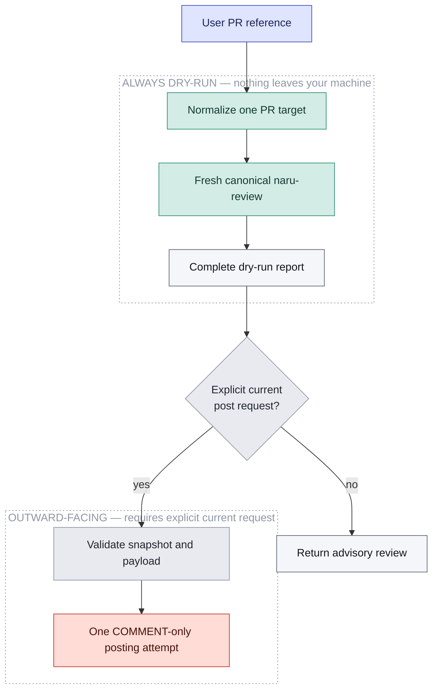

`naru-review` is dry-run by default. Posting requires a directly selected `naru-orchestrator` handling an explicit current natural-language request to post; custom agents cannot post.

<ul class="naru-legend">
  <li data-kind="read">Read-only</li>
  <li data-kind="danger">Leaves your machine</li>
</ul>

**Walkthrough:** references must normalize to one owner, repository, and positive pull number. A post request always obtains a fresh canonical review; pasted, stale, incomplete, degraded, or ambiguous results are rejected. Before POST, the tool rechecks a fresh final snapshot, head, feedback digest, inline locations, and existing marker. Same-target calls are serialized within one process using a bounded in-process PR table; cross-process deduplication remains impossible without durable external coordination, and ambiguous outcomes are never retried. The validated tool posts at most one comment-only review and never approves, requests changes, merges, or creates an ordinary issue comment.

For mixed implementation and review-post work, implementation, verification, judgment, remediation, and requested Git delivery finish first. The fresh review and posting attempt are the final serialized phase. See the canonical [user guide](/naru-opencode/user-guide/) for the full validation contract.
