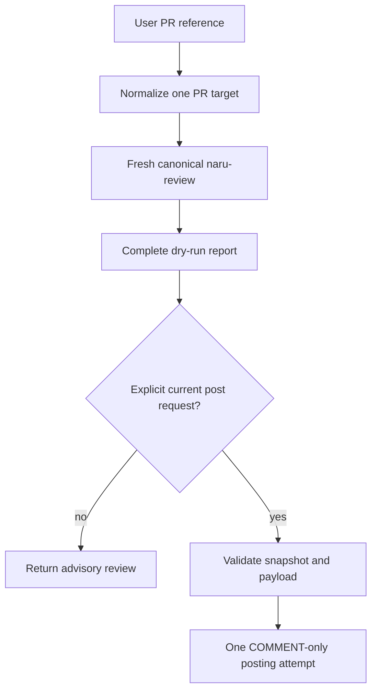

`/naru-review` is always a dry run. Posting requires either `/naru-review-post` or a directly selected `naru-orchestrator` handling an explicit current request to post.

**Walkthrough:** references must normalize to one owner, repository, and positive pull number. A post request always obtains a fresh canonical review; pasted, stale, incomplete, degraded, or ambiguous results are rejected. The validated tool posts at most one comment-only review and never approves, requests changes, merges, or creates an ordinary issue comment.

For mixed implementation and review-post work, implementation, verification, judgment, remediation, and requested Git delivery finish first. The fresh review and posting attempt are the final serialized phase. See the canonical [user guide](https://sean35mm.github.io/naru-opencode/user-guide/) for the full validation contract.
