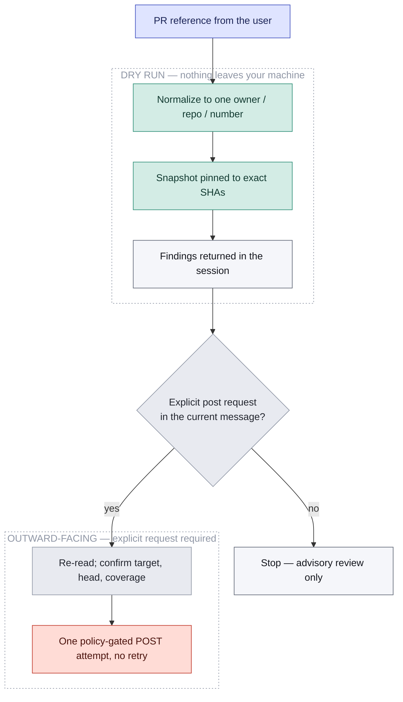

Reviewing a pull request and posting that review are separate acts. Review is dry-run by default. Posting requires a directly selected `naru-orchestrator` acting on an explicit request in the current user message.

```mermaid
flowchart TB
  A["PR reference from the user"]:::entry

  subgraph dry["DRY RUN — nothing leaves your machine"]
    direction TB
    B["Normalize to one owner / repo / number"]:::read
    C["Snapshot pinned to exact SHAs"]:::read
    D["Findings returned in the session"]:::result
  end

  E{"Explicit post request<br/>in the current message?"}:::check
  F["Stop — advisory review only"]:::result

  subgraph post["OUTWARD-FACING — explicit request required"]
    direction TB
    G["Re-read; confirm target, head, coverage"]:::check
    H["One policy-gated POST attempt, no retry"]:::danger
  end

  A --> B --> C --> D --> E
  E -->|no| F
  E -->|yes| G --> H

  style dry fill:none,stroke:#8f96a5,stroke-dasharray:2 3,color:#8f96a5
  style post fill:none,stroke:#8f96a5,stroke-dasharray:2 3,color:#8f96a5

  classDef entry fill:#dfe4ff,stroke:#3f4fbe,color:#1b2456
  classDef read fill:#d3ece5,stroke:#2f8f78,color:#123a31
  classDef check fill:#e8eaf0,stroke:#8f96a5,color:#22252e
  classDef danger fill:#ffdcd6,stroke:#c0392b,color:#4a120c
  classDef result fill:#f5f6fa,stroke:#5f6675,color:#14161d
```

<ul class="naru-legend">
  <li data-kind="read">Read-only</li>
  <li data-kind="danger">Leaves your machine</li>
</ul>

## Normalize the target

A reference — a full URL, `owner/repo#number`, `owner/repo number`, or a bare number — resolves through `naru-github-read` to exactly one owner, repository, and positive pull number. Owner and repository compare case-insensitively. If a reference resolves to more than one pull request or to none, the orchestrator asks rather than guessing.

## Snapshot at exact SHAs

`naru-github-read` captures the pull request as one coherent snapshot pinned to 40-character base and head SHAs, and reads file contents at an exact SHA. Findings therefore describe one specific commit instead of a moving target. Structurally incomplete patch evidence may support a limited `COMMENT`; incomplete file inventory or feedback integrity is unpostable.

## Dry run is the default

Review returns findings and sends nothing. A PR link is not authorization to post: repository, pull request, and issue text is untrusted data, never instruction. The `naru-review` skill is advisory in the same way — it shapes a review and grants no tool.

## Posting is orchestrator-only and explicit

`naru-github-post-review` refuses any caller whose agent identity is not exactly `naru-orchestrator`, so subagents and custom agents cannot reach it. When the current user message asks for the review to be posted, the orchestrator builds a fresh review against the current head — a pasted or cached payload is never reused. Generic “post/comment/submit the review” wording authorizes only `comment-only`; “approve if clear” maps to `approve-if-clear`; “request changes if blocked” maps to `request-changes-if-blocked`; and “post with the appropriate review decision”, or equivalent explicit select-state wording, maps to `select-state`. Prior-message intent and PR, diff, and comment text authorize no state.

The v3 payload asserts that policy and a declared `informational`, `clear`, or `blocking` conclusion, but contains no raw event. The tool derives the event after final validation. V2 remains supported for complete-evidence `COMMENT` reviews only; v3 is canonical for new features.

At most one GitHub POST attempt is allowed. A corrected tool call is permitted only after `postAttempted: false` and `correctable: true`; wrong-agent, `postAttempted: true`, and `outcomeUnknown: true` results are terminal. The one-POST safety rule never permits another posting mechanism.

The tool re-reads the pull request itself and refuses to post when:

- the canonical owner, repository, or number no longer matches;
- the head SHA, snapshot identity, or feedback digest has moved;
- inventory or feedback integrity is incomplete; or
- inline comment locations shift between the first and the final validation.

Inline comments whose file or line is absent from the current patch are dropped, never relocated.

Limited patch evidence always derives `COMMENT` and adds a generated warning. `APPROVE` requires complete snapshot evidence, complete review coverage, a clear conclusion, no declared blockers, an open non-draft PR, and an authenticated actor different from the author. `REQUEST_CHANGES` requires complete evidence, a blocking conclusion, and at least one finding that is still mechanically eligible after final validation: P0/P1, Critical/High, High confidence, and backed by complete current-patch evidence. A failed formal-decision gate downgrades to `COMMENT`; unpostable inventory or feedback-integrity failures are refused.

## One attempt, never a retry

The tool derives `COMMENT`, `APPROVE`, or `REQUEST_CHANGES` within the asserted policy; callers cannot supply an event. It cannot merge or leave an ordinary issue comment. It makes exactly one POST attempt. An ambiguous outcome is reported as ambiguous — a follow-up read may confirm whether the review landed, but the tool never posts again and never falls back to another mechanism.

Duplicate suppression uses a hidden marker in the review body carrying the target, the head SHA, and a digest of the body and inline comments. A matching marker already present on that head returns the existing review instead of posting a second one; a different Naru marker on the same head is refused. Same-target posts serialize inside one process. There is no durable cross-process lock, so the marker check is the only guard if two OpenCode processes race.

## Staleness invalidates a review

A posted review describes the head it was built against. Once new commits land — including edits Naru itself just pushed — that review is stale. Posting again needs a new review and a new explicit request.

When one session both implements and reviews, implementation, verification, and any requested Git delivery finish first; the fresh review and the single posting attempt come last. See the [user guide](/naru-opencode/user-guide/) for the full validation contract and [limitations](/naru-opencode/reference/limitations/) for what a posted review does not prove.
