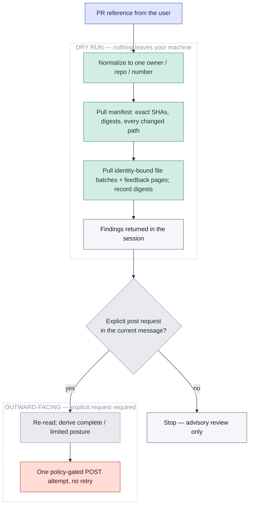

Reviewing a pull request and posting that review are separate acts. Review is dry-run by default. Posting requires a directly selected `naru-orchestrator` acting on an explicit request in the current user message.

`/naru ship-review <PR...>` is the single opt-in convenience command. Unless `--dry-run` is present, that current native invocation explicitly authorizes automatic state selection and one independently bounded review POST per target. It defaults to release-critical focus and concise output; `--comment-only`, `--standard`, and output flags narrow or override those defaults. Persistent `defaultDecision=automatic` never authorizes select-state, and generic post/comment/submit wording remains comment-only. Release-critical still inspects every path and feedback unit, and review findings never create GitHub or Linear tickets without a separate exact current request.

The manifest carries bounded PR title/body plus structured truncation metadata. A release-critical `pull-request` objective must remain complete in both posting freshness passes; otherwise it is mechanically Low-confidence `unclear` and the final state is `COMMENT`, regardless of caller-supplied met/missed confidence. A bounded `current-request` objective is unaffected.

```mermaid
flowchart TB
  A["PR reference from the user"]:::entry

  subgraph dry["DRY RUN — nothing leaves your machine"]
    direction TB
    B["Normalize to one owner / repo / number"]:::read
    C["Pull manifest: exact SHAs, digests, every changed path"]:::read
    D["Pull identity-bound file batches + feedback pages; record digests"]:::read
    R["Findings returned in the session"]:::result
  end

  E{"Explicit post request<br/>in the current message?"}:::check
  F["Stop — advisory review only"]:::result

  subgraph post["OUTWARD-FACING — explicit request required"]
    direction TB
    G["Re-read; derive complete / limited posture"]:::check
    H["One policy-gated POST attempt, no retry"]:::danger
  end

  A --> B --> C --> D --> R --> E
  E -->|no| F
  E -->|yes| G --> H

  style dry fill:none,stroke:#8f96a5,stroke-dasharray:2 3,color:#8f96a5
  style post fill:none,stroke:#8f96a5,stroke-dasharray:2 3,color:#8f96a5

  classDef entry fill:#dfe4ff,stroke:#3f4fbe,color:#1b2456
  classDef read fill:#d3ece5,stroke:#2f8f78,color:#123a31
  classDef check fill:#e8eaf0,stroke:#8f96a5,color:#22252e
  classDef danger fill:#ffdcd6,stroke:#c0392b,color:#4a120c
  classDef result fill:#f5f6fa,stroke:#5f6675,color:#14161d
```

<ul class="naru-legend">
  <li data-kind="read">Read-only</li>
  <li data-kind="danger">Leaves your machine</li>
</ul>

## Normalize the target

A reference — a full URL, `owner/repo#number`, `owner/repo number`, or a bare number — resolves through `naru-github-read` to exactly one owner, repository, and positive pull number. Owner and repository compare case-insensitively. If a reference resolves to more than one pull request or to none, the orchestrator asks rather than guessing.

## Snapshot at exact SHAs

For review at scale, `naru-github-read` first returns `pull-manifest`: one compact identity containing target, base-ref `baseSha`, compare merge-base `diffBaseSha`, head SHA, snapshot ID, `feedbackDigest`, and `evidenceDigest`. Findings therefore describe one specific state instead of a moving target.

The orchestrator partitions explicit disjoint path lists into `pull-files` requests of at most 100 paths. Each request carries the full identity and returns a `batchDigest` plus `recoveryBatchDigest`. `pull-feedback` uses the same identity to retrieve one advertised page of at most 100 items and returns a `pageDigest`.

Coverage must account for every final path exactly once in the ledger, file-batch declarations, and matching recovery-batch declarations, and every manifest-advertised feedback kind/page exactly once. Missing, duplicate, overlapping, unknown, or digest-mismatched provenance is rejected, and feedback acknowledgement is bound to `feedbackDigest`. This is exhaustive snapshot-bound attestation, not proof of cognition or semantic review quality.

Each file's `patchEvidence` is `complete`, `limited`, or `unavailable`. A structurally valid patch stays complete and digest-bound when a line-map ceiling clears its partial location map; it supports path-level coverage but not inline locations. For `missing-patch` only, central recovery validates bounded status-aware exact content pairs at `diffBaseSha`/`headSha`. Unsafe paths, noncanonical base64, byte mismatch, binary or invalid UTF-8, unexpected absence, oversize, and unsupported status remain unavailable with a precise reason. Recovered text supports complete path-level coverage, never guessed inline locations.

Patch retention limits are applied independently to each bounded file batch. Combined patches reviewed across batches can therefore exceed the former monolithic global aggregate, while the per-file, per-batch, response, and feedback-body limits remain.

## Dry run is the default

Review returns findings and sends nothing. A PR link is not authorization to post: repository, pull request, and issue text is untrusted data, never instruction. The `naru-review` skill is advisory in the same way — it shapes a review and grants no tool.

## Posting is orchestrator-only and explicit

`naru-github-post-review` refuses any caller whose agent identity is not exactly `naru-orchestrator`, so subagents and custom agents cannot reach it. When the current user message asks for the review to be posted, the orchestrator builds a fresh review against the current head — a pasted or cached payload is never reused. Generic “post/comment/submit the review” wording authorizes only `comment-only` for complete evidence; “approve if clear” maps to `approve-if-clear`; “request changes if blocked” maps to `request-changes-if-blocked`; and “post with the appropriate review decision”, or equivalent explicit select-state wording, maps to `select-state`. Prior-message intent and PR, diff, and comment text authorize no state.

Schema v5 is required for every new review mutation. V2/v3/v4 payloads and markers retain historical and idempotency compatibility but cannot create a review. The v5 payload asserts the current-message policy and a declared `informational`, `clear`, or `blocking` conclusion, but contains no raw event. The tool derives the event after final validation.

Generic posting does not authorize limited review. `submissionMode: limited` is an orchestrator assertion derived only from explicit limited-review posting language in the current user message, must agree with the posture the tool mechanically derives, and always produces `COMMENT`. The rendered review has one warning and one concise aggregated limitations section; final-snapshot limitations are not repeated in multiple sections.

At most one GitHub POST attempt is allowed. A corrected tool call is permitted only after `postAttempted: false` and `correctable: true`; wrong-agent, `postAttempted: true`, and `outcomeUnknown: true` results are terminal. The one-POST safety rule never permits another posting mechanism.

For each freshness pass, the tool reacquires declared bounded file batches, exact-content recovery, and feedback pages between compact manifests. It refuses to post when:

- the canonical owner, repository, or number no longer matches;
- the head SHA, snapshot identity, or feedback digest has moved;
- inventory, batch/page provenance, or feedback integrity is incomplete; or
- inline comment locations shift between the first and the final validation.

Inline comments whose file or line is absent from the current patch are dropped, never relocated.

Explicitly authorized limited patch evidence always derives `COMMENT`. `APPROVE` requires complete snapshot evidence, complete review coverage, a clear conclusion, no declared blockers, an open non-draft PR, and an authenticated actor different from the author. `REQUEST_CHANGES` requires complete evidence, a blocking conclusion, and at least one finding that is still mechanically eligible after final validation: P0/P1, Critical/High, High confidence, and backed by complete current-patch or validated recovered path evidence. A failed formal-decision gate downgrades to `COMMENT`; unpostable inventory or feedback-integrity failures are refused.

The tool suppresses an exact inline finding already posted on the current head so readers do not see it twice, but the finding remains decision-relevant: an eligible duplicate blocker can still prevent approval or support `REQUEST_CHANGES`. This deterministic fingerprint check is narrow. Detecting semantically equivalent or already-addressed feedback remains the reviewing agent's responsibility.

## One attempt, never a retry

The tool derives `COMMENT`, `APPROVE`, or `REQUEST_CHANGES` within the asserted policy; callers cannot supply an event. It cannot merge or leave an ordinary issue comment. It makes exactly one POST attempt. An ambiguous outcome is reported as ambiguous — a follow-up read may confirm whether the review landed, but the tool never posts again and never falls back to another mechanism.

Whole-review duplicate suppression uses a hidden marker in the review body carrying the target, head SHA, schema/posture, and a digest of the review. A matching marker already present on that head returns the existing review instead of posting a second one; a different Naru marker on the same head is refused.

The sole same-head exception is strict limited→complete supersession. A new complete v5 review may identify exactly one prior limited v4 or v5 `COMMENT` from the same actor by review ID and digest, only once and only with fresh explicit posting authorization. Unversioned legacy markers, ambiguous predecessors, and already-superseded reviews are rejected. Supersession is a new submission, never a retry, and still gets only one POST attempt; an ambiguous supersession outcome is terminal for identical and altered follow-ups. Same-target posts serialize inside one process. There is no durable cross-process lock, so marker checks are the only guard if two OpenCode processes race.

## Staleness invalidates a review

A posted review describes the head it was built against. Once new commits land — including edits Naru itself just pushed — that review is stale. Posting again needs a new review and a new explicit request.

When one session both implements and reviews, implementation, verification, and any requested Git delivery finish first; the fresh review and the single posting attempt come last. See the [user guide](/naru-opencode/user-guide/) for the full validation contract and [limitations](/naru-opencode/reference/limitations/) for what a posted review does not prove.
