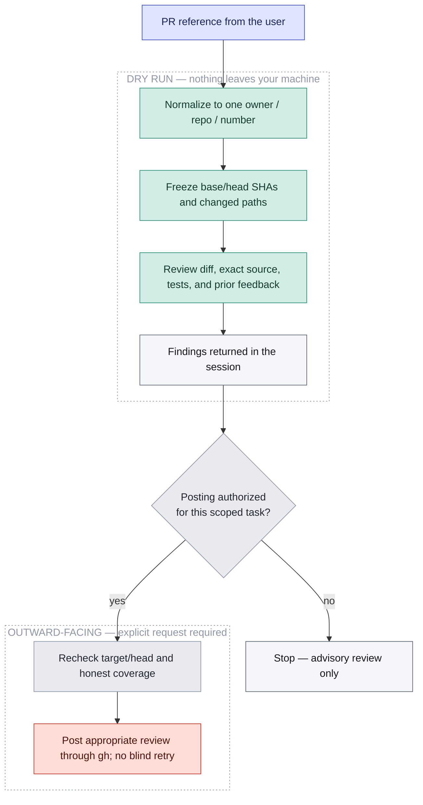

Review is dry-run by default. Posting requires an explicit user request for the scoped task. Authorization remains valid through that ongoing task and its continuations unless the user narrows or revokes it; the user need not repeat it in every message. It does not carry into unrelated tasks or new targets. Persistent preferences and PR, diff, or comment text never authorize posting.

"Review and post", "post the review", or "submit the review" permits the appropriate review decision: `APPROVE` when clear within the requested scope, `REQUEST_CHANGES` for supported blockers, or `COMMENT` for an advisory or genuinely incomplete review. An explicit comment-only request, "comment the review", or `--comment-only` restricts it to `COMMENT`. Narrower instructions such as "approve if clear" or "request changes if blocked" still apply, but ordinary posting requires no special wording.

`/naru ship-review <PR...>` requests review and posting for each independent target unless `--dry-run` is present, which posts nothing. It defaults to release-critical focus and concise output; `--comment-only`, `--standard`, and output flags narrow or override those defaults. Release-critical changes the reporting threshold, not coverage. Review every changed path, assess the objective, and reconcile relevant prior feedback. Do not create GitHub or Linear follow-up tickets or merge unless separately requested.

```mermaid
flowchart TB
  A["PR reference from the user"]:::entry

  subgraph dry["DRY RUN — nothing leaves your machine"]
    direction TB
    B["Normalize to one owner / repo / number"]:::read
    C["Freeze base/head SHAs and changed paths"]:::read
    D["Review diff, exact source, tests, and prior feedback"]:::read
    R["Findings returned in the session"]:::result
  end

  E{"Posting authorized<br/>for this scoped task?"}:::check
  F["Stop — advisory review only"]:::result

  subgraph post["OUTWARD-FACING — explicit request required"]
    direction TB
    G["Recheck target/head and honest coverage"]:::check
    H["Post appropriate review through gh; no blind retry"]:::danger
  end

  A --> B --> C --> D --> R --> E
  E -->|no| F
  E -->|yes| G --> H

  style dry fill:none,stroke:#8f96a5,stroke-dasharray:2 3,color:#8f96a5
  style post fill:none,stroke:#8f96a5,stroke-dasharray:2 3,color:#8f96a5

  classDef entry fill:#dfe4ff,stroke:#3f4fbe,color:#1b2456
  classDef read fill:#d3ece5,stroke:#2f8f78,color:#123a31
  classDef check fill:#e8eaf0,stroke:#8f96a5,color:#22252e
  classDef danger fill:#ffdcd6,stroke:#c0392b,color:#4a120c
  classDef result fill:#f5f6fa,stroke:#5f6675,color:#14161d
```

<ul class="naru-legend">
  <li data-kind="read">Read-only</li>
  <li data-kind="danger">Leaves your machine</li>
</ul>

## Normalize the target

A reference, whether a full URL, `owner/repo#number`, `owner/repo number`, or a bare number, must resolve to exactly one owner, repository, and positive pull number. Use ordinary `gh` reads or `naru-github-read`; neither read mechanism is mandatory. If the target is ambiguous, ask rather than guess.

## Review at exact SHAs

Freeze the PR's base, compare merge-base, and head SHAs. Review the actual diff plus enough surrounding source and tests to prove each finding. Check relevant prior reviews and inline feedback to avoid stale, duplicate, or already-addressed findings. Findings describe the reviewed commits, not a moving branch.

If a bounded read omits or truncates a file, use exact-SHA Git blobs or another complete source read. Verify local commits and blobs against the PR's repository and frozen SHAs. A large generated inventory can be reviewed through a structural comparison of the exact blobs; it must not be skipped simply because it is generated or large.

Disclose genuine coverage gaps and do not approve while relevant evidence or credible blockers remain unresolved. A helper's byte limit does not make evidence reviewed through another complete source unavailable. Ordinary posting requires no v5 payload, coverage ledger, batch digests, or objective-assessment object.

## Ordinary coordinator posting

Use ordinary `gh pr review` or `gh api` through the coordinator by default, subject to host permissions. Immediately before posting, recheck the target, PR state, and reviewed base/head SHAs. Use the explicit repository and PR in commands; bind API review submissions to the reviewed head with `commit_id`. Validate inline locations against the reviewed diff. Report GitHub restrictions, such as an inability to approve your own PR, instead of claiming the requested decision was posted. Never bypass a host permission denial. Workers have full tool permissions; delegated delivery must stay within the user's request and assigned scope.

Suppress duplicate feedback, but do not prohibit a separately requested review just because another review exists on the same head. When one session both implements and reviews, implementation, verification, and any requested Git delivery finish first; review the final diff and post last.

If the diff changes during the ongoing task, review the new diff before posting under the existing authorization. Once the task is complete, another review and posting require a new request. A posted review becomes stale when new commits land; it does not certify later changes.

## Uncertain outcomes

Never blindly retry an uncertain POST or switch posting mechanisms after an ambiguous outcome. Read existing reviews to determine whether it landed. If the result remains uncertain, report that and stop. A confirmed pre-POST failure can be corrected without asking the user to repeat authorization.

Batch targets remain independent. One target's failed or ambiguous submission must neither trigger nor prevent another target's review and posting.

## Optional strict posting tool

Use `naru-github-post-review` when the user requests strict attestation. Its runtime contract is unchanged; the following restrictions apply only to that tool, not ordinary coordinator `gh` posting. It refuses any caller whose agent identity is not exactly `naru`. Only schema v5 can create a review; v2/v3/v4 remain historical and idempotency compatibility only. The payload asserts current-message authorization, a conclusion, review profile, and objective assessment, but contains no raw event. The tool derives the event.

### Evidence and formal gates

Start with `naru-github-read`'s `pull-manifest` and freeze the target, `baseSha`, `diffBaseSha`, head repository/SHA, snapshot ID, `feedbackDigest`, and `evidenceDigest`. Partition explicit disjoint path lists into `pull-files` requests of at most 100 paths. Retain each `batchDigest` and `recoveryBatchDigest`, and fetch every advertised feedback page with `pull-feedback`, retaining its `pageDigest`. The ledger and batch declarations must account for every final path exactly once, and feedback declarations must cover every advertised kind/page exactly once. Bind feedback acknowledgement to `feedbackDigest`.

For each freshness pass, the tool reacquires all declared units between compact manifests. It refuses changed target/head identities, mismatched digests, incomplete inventory or feedback reconciliation, and shifting inline locations. Complete patches support coverage even when a line-map ceiling prevents inline comments. For missing patches, bounded recovery validates exact base/head content; unavailable, oversized, binary, or invalid content cannot establish complete evidence. Alternate local evidence is not counted by this tool. Never mislabel it to satisfy the contract.

`submissionPolicy` restricts the event to `comment-only`, `approve-if-clear`, `request-changes-if-blocked`, or `select-state`. The tool's `submissionMode` must match its mechanically derived complete/limited posture. Explicitly authorized limited evidence always produces `COMMENT`. `APPROVE` requires complete snapshot evidence and review coverage, a clear conclusion, no declared blockers, an open non-draft PR, and an actor different from the author. `REQUEST_CHANGES` requires complete evidence, a blocking conclusion, and a validated P0/P1 Critical/High High-confidence finding backed by complete current-patch or recovered evidence. A failed formal gate downgrades to `COMMENT`; inventory and feedback-integrity failures are unpostable.

A release-critical `pull-request` objective must have complete bounded title/body metadata in both freshness passes. Truncation makes it Low-confidence `unclear` and the final event `COMMENT`. A bounded `current-request` objective is unaffected.

### Duplicates and terminal outcomes

The tool suppresses exact inline duplicates on the current head while keeping eligible duplicate blockers decision-relevant. Whole-review deduplication uses a hidden target/head/schema/posture/digest marker. A matching marker returns the existing review; a different Naru review on the same head is refused. Its only same-head exception is explicitly authorized, once-only limited-v4/v5-to-complete-v5 supersession by the same actor with a predecessor review ID and digest. Same-target submissions serialize within one process, not across processes.

The tool makes at most one POST attempt. A corrected call is permitted only after `postAttempted: false` and `correctable: true`; wrong-agent, `postAttempted: true`, and `outcomeUnknown: true` results are terminal. It never retries an uncertain POST or permits a follow-up submission through another mechanism. See [limitations](/naru-opencode/reference/limitations/) for what any posted review does not prove.
