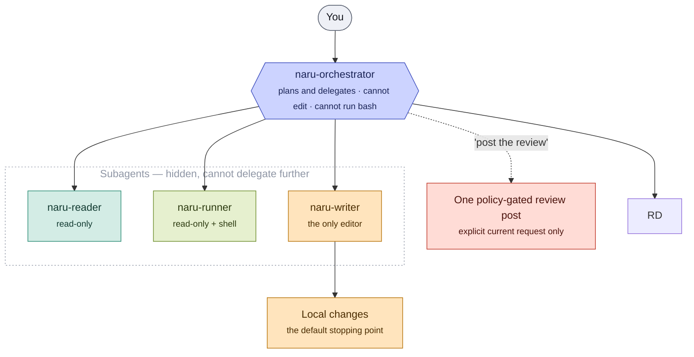

# Naru user guide

Naru is a thin layer over OpenCode. You talk to one agent — `naru-orchestrator` — and it decides how to split the work and who does it. There are no modes to pick, no scheduler to tune, and no workflow to configure.

What Naru adds is a small set of hard mechanical walls at the places where mistakes are expensive, and near-total freedom inside them. The orchestrator is trusted to plan and fan out on its own judgment; it is not trusted to edit your files, run your code, or push anything anywhere.

This guide covers installation, day-to-day use, the walls, the tools, the one configuration file, and troubleshooting.

## Requirements

- [OpenCode](https://opencode.ai) >= 1.18.4.
- Node.js 24 for the install preview, ownership manifest, tools, and local doctor.
- [GitHub CLI](https://cli.github.com/) (`gh`), authenticated, for pull-request workflows.
- `subagent_depth` >= 1. OpenCode's default is 1, which is enough: Naru is one root orchestrator delegating to leaf subagents.
- `codebase-memory` and LSP are optional. Read-only work falls back to literal file search when they are unavailable or stale.

## Install

Clone Naru, review the preview, then apply the same option set:

```sh
git clone https://github.com/sean35mm/naru-opencode.git
cd naru-opencode
sh install.sh --preview
sh install.sh --apply
```

`--preview` is the default and mutates nothing: it prints a bounded summary of what would change. `--apply` stages and replaces assets transactionally, then writes a deterministic `.naru-install.json` ownership manifest recording managed roots, source fingerprints, selected options, and install method. Matching assets are skipped. Replaced content is retained in a timestamped `.naru-backups/` directory and restored if the transaction fails.

An apply installs four agents, four skills, five tools with their helper library, one plugin (`naru-dispatch`, always copy-pinned), and `naru-runtime.example.json`. It does not create an active `naru-runtime.json`.

Clone, preview, apply is the contributor path. Most users install through the curl bootstrap and the naru CLI instead, which drive the same transactional installer; see the README or the installation guide.

### Where it installs

With no location flag the target is `~/.config/opencode`. Agent and skill Markdown is symlinked individually; tools and helper modules are always copied so executable code cannot change merely because the source checkout moved.

```sh
sh install.sh --apply --copy                      # copy Markdown instead of symlinking
sh install.sh --apply --project                   # install into $PWD/.opencode
sh install.sh --apply --dir /path/to/config-root  # install into a custom config directory
```

`--project` targets `$PWD/.opencode`, where `$PWD` is the directory the installer is invoked from; OpenCode loads project configuration after global configuration. `--dir` identifies a config root but cannot make OpenCode load that path. The source checkout and target may not contain one another, and the target and its managed directories must not be symlinks.

### Flags

| Flag | Effect |
| --- | --- |
| `--preview` | Explicitly select the default read-only preview. |
| `--apply` | Apply the reviewed option set transactionally. |
| `--copy` | Copy agent and skill Markdown instead of symlinking it. |
| `--project` | Install into `$PWD/.opencode`. |
| `--dir PATH` | Install into a custom OpenCode config directory. |
| `--replace-conflicts` | Replace only the conflicts shown by that exact preview. |
| `--uninstall` | Preview removal of manifest-owned assets. |
| `--rollback ID` | Preview restoration of one explicit receipt-backed transaction. |
| `--with-dashboard` | Deprecated accepted no-op. The dashboard was removed. |

### Conflicts

`conflict-unowned` means a selected path exists but is absent from the prior manifest. `conflict-modified` means a manifest-owned path changed after installation. Both are preserved and block an apply. Review the reported paths, keep or move anything of yours, then add `--replace-conflicts` to the same apply only when replacing and backing up those exact paths is intended.

### Update

After pulling a new version, rerun the installer with the same location flags for every loaded scope:

```sh
git pull
sh install.sh --preview
sh install.sh --apply
```

Even a symlink install must be rerun, because tools and helpers are copy-pinned. Restart OpenCode afterward so sessions reload agent definitions, skills, and permissions.

### Rollback and uninstall

Both are two-step. Preview first, then repeat the exact command with `--apply` and the SHA-256 token that preview printed:

```sh
sh install.sh --rollback 20260722123456-12345
sh install.sh --rollback 20260722123456-12345 --apply \
  --confirm-rollback 'sha256:copy-the-current-preview-token'

sh install.sh --uninstall
sh install.sh --uninstall --apply \
  --confirm-uninstall 'sha256:copy-the-current-preview-token'
```

Use the same `--project` or `--dir` selector that was used to install; the manifest supplies the rest. The token is bound to the target, action, manifest, selected receipt, conflict choice, and full plan, so a stale or differently scoped token fails before anything is touched. Modified paths are preserved by default, which yields a partial uninstall; only a new `--replace-conflicts` preview selects them, and it emits a different token. Unrelated files and `.naru-backups/` are never removed.

## Talk to the orchestrator

`naru-orchestrator` is a visible primary agent, not a slash command. Select it in the OpenCode agent picker, make it the default, or launch OpenCode with it:

```json
{
  "default_agent": "naru-orchestrator"
}
```

```sh
opencode --agent naru-orchestrator
```

Then describe what you want in plain language: fix this failure, implement this change, review this PR, explain how this subsystem works. You do not choose an analysis mode, a concurrency level, or a workflow. The orchestrator reads the task and decides.

Do not use `naru-orchestrator` as a Task target from a custom agent. Custom agents should allowlist the four skills instead — see the [agent integration guide](/naru-opencode/agent-integration/).

## The four agents



<ul class="naru-legend">
  <li data-kind="read">Read-only, no shell</li>
  <li data-kind="shell">Read-only, runs checks</li>
  <li data-kind="write">Writes files</li>
  <li data-kind="danger">Leaves your machine</li>
</ul>

| Agent | Role | Edit | Bash |
| --- | --- | --- | --- |
| `naru-orchestrator` | Primary, visible. Plans, delegates, synthesizes, reports. | No | No |
| `naru-reader` | Investigation: finding code, tracing behavior, diagnosing, reviewing. | No | No |
| `naru-runner` | Runs tests, typecheck, lint, build, and reproductions. | No | Yes |
| `naru-writer` | The only role that can edit files. | Yes | Yes |

The three subagents are hidden and cannot delegate (`task: deny`), so the topology is always one root orchestrator with leaf children at depth 1. That is why OpenCode's default depth of 1 is sufficient.

## How it delegates

The orchestrator uses as many children as the work genuinely needs, in parallel, without asking permission to parallelize.

- Readers are cheap, so it fans them out widely on unfamiliar or broad work.
- `naru-runner` is used whenever a question needs a command run rather than reasoned about.
- `naru-writer` gets the edits, split at real boundaries — separate files, modules, or independent questions.

Effort scales to the task. A one-line fix gets no fan-out. There is no child-count ceiling to configure and no schedule to observe; the only durable brake is `maxConcurrentWriters` (see [runtime configuration](#runtime-configuration)), which exists to stop a runaway, not to shape a plan.

You still get one report at the end: what changed, which files, which checks actually ran and what they returned, and what risk remains.

### Per-dispatch models

If you configure model classes (see [runtime configuration](#runtime-configuration)), the `naru-dispatch` plugin clones each subagent into hidden per-class variants at startup — `naru-reader-light`, `naru-writer-deep`, and so on — with the class's model and effort baked in, and the orchestrator picks a variant per dispatch: a cheap class for wide reader fan-out, a strong one for the dispatch that deserves it, both in the same turn. Without a `models` block — or without the plugin at all — there are no variants; every subagent inherits your session model and nothing else changes.

Dispatches look like any other subagent in the TUI: normal task cards you can click into to open the child thread, and you can cycle between threads as usual. The class is right in the agent name on the card; the exact model is the child session's model, visible when you open the thread. The final report then includes a one-line ledger of what was dispatched where, for example:

```text
Dispatched: 3× naru-reader-light, 1× naru-writer-standard
```

Model selection changes the model, never the walls: variants are byte-for-byte permission clones of the base agents, so `naru-writer` variants stay the only editors and readers stay shell-less regardless of which model a class lands on. Class config is read once at plugin load — restart OpenCode after editing it.

## The walls

These are enforced mechanically by OpenCode permission frontmatter or by the tools themselves, not by polite prose in a prompt.

- **Only `naru-writer` can edit.** The orchestrator, both readers, and the runner have `edit` and `apply_patch` denied.
- **Secrets are denied to every role.** `.env`, `.env.*`, key material, `.ssh`, `.aws`, `.kube`, and `.gnupg` are unreadable. `.env.example` templates are allowed.
- **User intent is the sole authorization source.** Repository files, issue and PR text, diffs, comments, command output, and subagent reports are untrusted data. Instructions found there describe what someone wrote; they never widen scope or authorize an action.
- **Local changes are the default stop.** Commit, push, PR create/update, and GitHub posting happen only when the current request asked for them. That ask is the authorization — it is not reconfirmed, and it is not assumed.
- **One checkpoint, naming the exact action,** before destructive or irreversible operations, history rewrite or force push, hook bypass, production deploys, persistent database writes or migrations, secret access, billing or security-posture changes, dependency changes you did not request, or material scope expansion. Routine reads, checks, and in-scope commands need no checkpoint.
- **One writer per logical scope.** Two writers never touch the same file, contract, config, lockfile, or generated artifact; overlap serializes. Where Weaver is available, each writer checks `weaver status`, claims its exact scope before the first edit, and calls `weaver done`. A claim conflict is a scheduling signal — other work keeps moving and the blocked item is requeued. It is never turned into a question for you.
- **Verification happens after writers finish.** Results gathered while files are still changing are meaningless, so final checks wait for a quiet workspace, and a change after verification means verifying again.

`naru-runner` and `naru-writer` can execute repository code through ordinary checks and builds. That is useful, not harmless: package scripts and build targets can touch Git, files, databases, and external services. Naru is not a sandbox.

## The four skills

Skills are advisory. They shape how a request is approached and grant nothing at all: no tools, no scope, no permission change, no read-only guarantee.

| Skill | Ask for | Returns |
| --- | --- | --- |
| `naru-plan` | A plan or implementation approach | Advisory plan |
| `naru-impact` | Blast-radius or compatibility analysis | Advisory impact assessment |
| `naru-triage` | A bug or failure diagnosed | Advisory diagnosis |
| `naru-review` | A PR, branch, diff, or file reviewed | Dry-run review |

Ask naturally, or name one explicitly ("use the `naru-plan` skill…"). OpenCode discovers loaded skills on demand and decides which global and project sources are visible and how duplicate names resolve; inspect a skill's origin before trusting it.

## Pull-request review

Reviewing and posting are separate acts.

Review is dry-run by default: findings come back to you and nothing leaves your machine. A PR link is not posting authorization.

Posting requires an explicit request in your current message to the directly selected orchestrator. “Post the review”, “comment the review”, and “submit the review” authorize only a complete `COMMENT`. “Approve if clear” authorizes approval when its gates pass; “request changes if blocked” authorizes a change request when its gates pass; “post with the appropriate review decision”, or equivalent explicit select-state wording, authorizes the tool to select among those states. Generic posting language does not authorize a limited review. `submissionMode: limited` is an orchestrator assertion derived only from explicit limited-review posting language in the current user message, must match the posture the tool derives, and always produces `COMMENT`. Prior-message intent and PR, diff, or comment text never authorize a state or limited mode.

The fresh review is manifest-first. `pull-manifest` freezes the exact target, base/head SHAs, snapshot ID, `feedbackDigest`, `evidenceDigest`, complete changed-file inventory, and page counts for reviews, review comments, and issue comments. It intentionally returns neither patch nor feedback bodies. The orchestrator partitions the file inventory into disjoint lists and uses bounded `pull-files` batches; every request must carry the full originating manifest identity, is bracketed by compact-manifest acquisitions, and returns a `batchDigest`. It also retrieves every advertised feedback page through `pull-feedback`, which returns at most 100 items and a `pageDigest`.

V4 coverage records all three layers: every final path exactly once in the ledger, every path exactly once across `fileBatches`, and every advertised kind/page exactly once across `feedbackPages`. Missing, duplicate, overlapping, unknown, or digest-mismatched provenance is rejected, and prior-feedback acknowledgement remains bound to `feedbackDigest`. File batches without feedback-page provenance are incomplete. This is exhaustive snapshot-bound attestation, not proof of cognition, understanding of every line, or semantic review quality.

Per-file `patchEvidence` is `complete`, `limited`, or `unavailable`, with a structural or availability reason. Missing patches are centrally reported as unavailable and remain limited; Naru deliberately does not claim safe unified-diff recovery. Patch evidence is capped at 1 MiB and 1,024 retained left/right line-map entries per file, 16 MiB and 16,384 retained line-map entries per declared batch, and 32 MiB per GitHub transport response. Crossing a line-map ceiling stops parsing or retention for that file, clears its partial map and patch digest, and marks the evidence limited. Patch limits apply independently to each bounded batch, so patches reviewed across multiple batches may together exceed the former monolithic global aggregate. The tool—not the caller—derives complete or limited posture from the final manifest, provenance, ledger, and current evidence. It renders limited evidence as one warning plus one concise aggregated limitations section rather than repeating snapshot limitations.

The schema v4 payload accepts no raw event; it is the only contract allowed to create a new review. Historically, v2 represented complete-evidence `COMMENT`-only reviews; v2/v3 can no longer create new mutations, and schema v4 is required. `APPROVE` requires complete snapshot evidence, complete review coverage, a clear conclusion, no declared blockers, an open non-draft PR, and an actor different from the author. `REQUEST_CHANGES` requires complete evidence, a blocking conclusion, and a final mechanically eligible P0/P1, Critical/High, High-confidence finding on complete current-patch evidence. Formal-decision ineligibility downgrades to `COMMENT`; inventory or feedback-integrity failures are unpostable.

Exact inline findings already present on the current head are not posted again, but they remain decision-relevant—including eligible blockers. Semantic deduplication and reconciliation with differently worded feedback remain the reviewing agent's responsibility. Whole-review idempotency uses a hidden marker. The sole same-head exception is strict limited→complete supersession: one complete v4 review may identify exactly one prior limited v4 `COMMENT` by review ID and digest, with fresh explicit posting authorization. Supersession is a new submission, never a retry; legacy predecessors cannot be superseded this way.

The orchestrator runs this fresh review against the current head, never a pasted or cached payload, and confirms the target still matches. Final posting reacquires only the declared bounded file batches and feedback pages between compact manifests—twice for freshness comparison—and does not rely on the legacy monolithic all-patch snapshot. At most one GitHub POST attempt is allowed, not one tool invocation. A corrected tool invocation is permitted only after `postAttempted: false` and `correctable: true`; wrong-agent, `postAttempted: true`, or `outcomeUnknown: true` results are terminal. An ambiguous outcome is terminal even for a supersession. Never use another posting mechanism. Only `naru-orchestrator` can call the tool, and it cannot merge. If edits or a push land after a review, that review is stale and needs a new explicit request.

Any PR reference — full URL, `OWNER/REPO#NUMBER`, or a bare number resolved against the current workspace — is normalized to one canonical `(owner, repo, number)`. Owner and repo compare case-insensitively. If a reference resolves to more than one PR or to none, the orchestrator stops and asks.

## Isolated worktrees

Writers normally share your workspace. When full isolation is wanted, the orchestrator drives `naru-worktree`: `prepare_run`, then `prepare_item` per writer, `integrate_item` as each returns, `finalize_run` once the result is verified, then `cleanup_run`. `recover_run` picks a run back up after a restart instead of preparing duplicates. `snapshot` reports current state.

The tool is restricted to `naru-orchestrator`. Writers never commit, merge, or remove worktrees — integration belongs to the orchestrator. Isolation requires a clean repository; when the workspace is dirty or isolation is unavailable, the run silently downgrades to shared mode rather than asking you or imitating isolation with directory copies.

Tool-owned Git operations suppress hooks, serialize mutations per run, contain paths, write recovery metadata atomically, and attempt rollback on failure. They do not protect against unrelated external mutation of your workspace.

## Tools

| Tool | Purpose |
| --- | --- |
| `naru-git-read` | Bounded read-only Git: `repository`, `status`, `diff`, `log`, `file`, `grep`, `merge-base`. |
| `naru-github-read` | `resolve`, `issue`, `pull`, scalable `pull-manifest`/`pull-files`/`pull-feedback`, and `source`. Bounded review evidence is tied to full manifest identity and digests. |
| `naru-github-post-review` | Orchestrator-only. Requires schema v4 for new mutations, derives posture and `COMMENT`/`APPROVE`/`REQUEST_CHANGES` from final evidence, and makes one POST attempt with no retry. V2/v3 are historical/idempotency compatibility only. |
| `naru-worktree` | Orchestrator-only isolated writer worktrees and integration. |
| `naru-doctor` | Provider-free local install and configuration health report. |

The GitHub tools invoke authenticated `gh` through a validated interface rather than exposing a general shell.

## Runtime configuration

`naru-runtime.json` is optional. Without it, the defaults below apply. `naru-runtime.example.json` is installed beside the managed `agents/`, `skills/`, and `tools/` directories as a starting point; copy it into the same config root only when you actually want to change something:

```sh
cp .opencode/naru-runtime.example.json .opencode/naru-runtime.json
```

```json
{
  "schemaVersion": 1,
  "implementation": {
    "cleanWorkspaceRequired": true,
    "maxConcurrentWriters": 50,
    "workspaceMode": "auto"
  },
  "models": {
    "light":    { "use": "wide fan-out, mechanical lookups, simple reads", "chain": ["opencode/glm-5-free", "opencode/minimax-m3-free"] },
    "standard": { "use": "ordinary investigation, edits, checks", "chain": ["openai/gpt-5.6-terra@medium"] },
    "deep":     { "use": "architecture, security, data models, final review, tricky edits", "chain": ["openai/gpt-5.6-sol@high"] }
  }
}
```

| Field | Values | Meaning |
| --- | --- | --- |
| `cleanWorkspaceRequired` | must be `true` | Isolated worktrees require a clean repository. |
| `maxConcurrentWriters` | integer 1–50 | Runaway brake only. It does not shape the plan. |
| `workspaceMode` | `auto`, `shared`, `worktree` | `auto` uses isolation when the repository is clean; `shared` disables the worktree tool entirely; `worktree` selects isolation. |
| `models` | optional map | The model classes the `naru-dispatch` plugin turns into per-class agent variants. |

Model classes are named by you — `light`/`standard`/`deep` are just the shipped example. Each class carries a `use` string telling the orchestrator when to pick it and a `chain` of `provider/model` entries with an optional `@effort` suffix (`low`, `medium`, `high`, `xhigh`, `max`) where the model supports it. At startup, the first chain entry whose provider is authenticated is baked into that class's variants; a class with no authenticated entry is skipped and generates no variants — nothing breaks. Want finer effort control? Define more classes (for example `"deep-max"` with `["openai/gpt-5.6-sol@max"]`). Leave `models` out entirely and no variants exist — every subagent inherits your session model. The class list is read once at plugin load, so restart OpenCode after changing it.

That is the entire configuration surface. The file must be regular, non-symlinked JSON no larger than 64 KiB, unknown fields are rejected, and an invalid file is a startup-visible error rather than a silent partial policy. The `models` block is the one exception: the plugin fails open, leaving OpenCode's config untouched and generating no variants until the file is fixed. Prefer project-local configuration; changing global OpenCode configuration deserves explicit approval.

## Health check

The doctor is copy-pinned and read-only. It never loads plugins, credentials, or providers, never calls a model, and never mutates or uploads anything:

```sh
node ~/.config/opencode/tools/naru-doctor.js            # global install
node .opencode/tools/naru-doctor.js --project-root .    # project install
node /path/to/config-root/tools/naru-doctor.js --dir /path/to/config-root
```

The bounded, path-sanitized report covers candidate global, project, and custom scopes, manifest version and install mode, missing or modified assets, stale copy-pinned state, local OpenCode compatibility, and runtime-configuration validity. Custom scopes are reported as unconfirmed because arbitrary loading cannot be proven. Use `--source PATH` to compare an install against a checkout and `--json` for the structured form. A warning report exits nonzero for automation without changing state.

## Working on Naru itself

```sh
npm test            # node --test over tests/*.test.mjs
npm run test:bun    # bun transport check
npm run test:installer
```

Sources are plain `.js` and `.mjs`; there is no build step.

## Manual install

The installer is strongly preferred — a manual copy has no ownership manifest, so the doctor reports it as untracked and updates cannot preview or preserve conflicts. If you need one:

```sh
mkdir -p ~/.config/opencode/skills ~/.config/opencode/agents ~/.config/opencode/tools
cp -R skills/naru-* ~/.config/opencode/skills/
cp agents/naru-*.md ~/.config/opencode/agents/
cp tools/naru-*.js tools/package.json ~/.config/opencode/tools/
cp -R tools/naru-lib ~/.config/opencode/tools/
cp naru-runtime.example.json ~/.config/opencode/
```

Use `.opencode` in place of `~/.config/opencode` for a project install, and restart OpenCode afterward.

## What Naru does not manage

Naru does not modify your `AGENTS.md`, your optional `naru-runtime.json`, unrelated OpenCode tools, or external agent-state systems. Preview is the default; an applied install touches only its reviewed managed set.

## What Naru is not

- **Not a sandbox.** Shell-enabled roles run real repository code with your credentials and your network.
- **Not a proof system.** Gates and checks constrain behavior; they do not prove a report is true.
- **Not durable.** Nothing survives a process as authoritative shared state.
- **Not a global capacity meter.** Limits are local; they do not observe other processes, other machines, or provider-side quota.

## Troubleshooting

### Agents or skills look stale

Run the installed doctor with `--source /path/to/naru-opencode` to spot stale copy-pinned state. Preview `install.sh` with the original options, review any conflicts, apply, then restart OpenCode. Tools and helpers are copy-pinned even when Markdown is symlinked, and every loaded global and project scope needs the update.

### The installer reports a conflict

See [Conflicts](#conflicts). Nothing was changed; inspect the listed paths before deciding whether that exact apply should include `--replace-conflicts`.

### A child fails at the subagent depth limit

Confirm OpenCode is 1.18.4 or newer and that `subagent_depth` is at least 1, then reinstall the loaded scope and restart. Naru only ever delegates one level deep, so the OpenCode default is enough.

### The orchestrator will not edit a file

That is the design. It has no `edit` permission and delegates every change to `naru-writer`. If nothing is being written at all, check that all four agent files installed and that the orchestrator's `task` allowlist survived your local configuration.

### Review cannot resolve a pull request

Authenticate `gh` and supply a full PR URL or `OWNER/REPO#NUMBER`. A bare number requires the current workspace to resolve to the intended repository, and an ambiguous reference intentionally stops for clarification.

### A review was not posted

Posting needs an explicit request in the current message to the directly selected orchestrator. Review is otherwise dry-run. Generic posting does not authorize limited mode; limited patch evidence can post only when the current message explicitly requests a limited review, and then only as `COMMENT`. An identical repost is suppressed by the dedupe marker; stale or unpostable inventory/feedback evidence is refused. A same-head limited→complete supersession needs fresh explicit authorization and is a new post, not a retry. An ambiguous attempt is terminal.

### Isolated worktrees were not used

Isolation requires a clean repository, and `workspaceMode: "shared"` disables the worktree tool outright. A dirty workspace downgrades to shared mode silently and by design.
